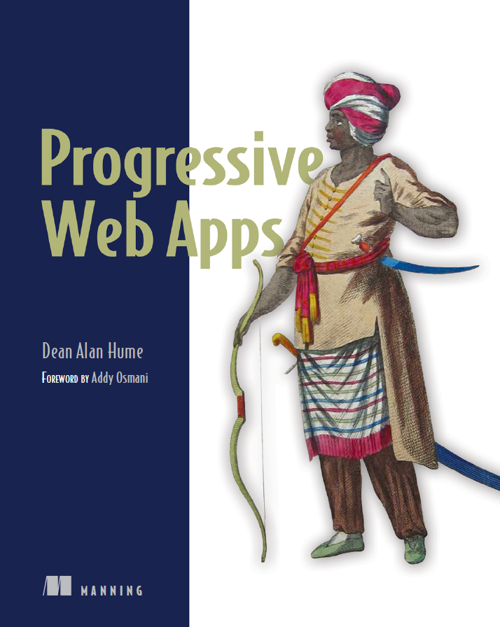

# [Progressive Web Apps (PWA)](https://www.manning.com/books/progressive-web-apps) 中文版

## 重要通知

**目前已经和本书中文版权方博文视点达成出版意向，目前已开放章节仅作为纸版书的开放阅读部分，并非完整和最终版本，后续还有大量修订和优化，后续章节目前正在紧张翻译中，虽然不会再同步开源至 GitHub ，但会第一时间在这里将翻译出版进度同步给各位。敬请大家关注纸版书的发布，预计出版时间: 2018年上半年。另外感谢大家的关注与支持，部分读者将有机会第一时间获赠纸质书。**

> 本书通篇会将 `Progressive Web Apps` 直译成缩写形式 `PWA`，一方面是篇幅原因(名词过长)，另一方面由于译者偏好(将 PWA 进行到底)

## 本书目录

- [第1部分 | 定义 PWA](./Part1.md)
- [第1章 | 理解 PWA](./ch01/README.md)
  - [1.1 PWA 有什么优势？](./ch01/1.1.md)
  - [1.2 Service Workers: PWA 的关键](./ch01/1.2.md)
  - [1.3 性能洞察: Flipkart](./ch01/1.3.md)
  - [1.4 总结](./ch01/1.4.md)
- [第2章 | 构建 PWA 的第一步](./ch02/README.md)
  - [2.1 建立在现有基础之上](./ch02/2.1.md)
  - [2.2 构建 PWA 的前端架构方式](./ch02/2.2.md)
  - [2.3 逐步剖析现有的 PWA](./ch02/2.3.md)
  - [2.4 总结](./ch02/2.4.md)
- [第2部分 | 更快的 Web 应用](./Part2.md)
- [第3章 | 缓存](./ch03/README.md)
  - [3.1 HTTP 缓存基础](./ch03/3.1.md)
  - [3.2 Service Workers 缓存基础](./ch03/3.2.md)
  - [3.3 缓存前后的性能比对](./ch03/3.3.md)
  - [3.4 深入 Service Workers 缓存](./ch03/3.4.md)
  - [3.5 总结](./ch03/3.5.md)
- [第4章 | 拦截网络请求](./ch04/README.md)
  - [4.1 Fetch API](./ch04/4.1.md)
  - [4.2 Fetch 事件](./ch04/4.2.md)
  - [4.3 Fetch 实战](./ch04/4.3.md)
  - [4.4 总结](./ch04/4.4.md)
- [第3部分 | 吸引人的 Web 应用](./Part3.md)
- [第5章 | 外观感受](./ch05/README.md)
  - [5.1 Web 应用清单](./ch05/5.1.md)
  - [5.2 添加到主屏幕](./ch05/5.2.md)
  - [5.3 添加到主屏幕的高级用法](./ch05/5.3.md)
  - [5.4 调试清单文件](./ch05/5.4.md)
  - [5.5 总结](./ch05/5.5.md)
- [第6章 | 推送通知](./ch06/README.md)
  - [6.1 与用户互动](./ch06/6.1.md)
  - [6.2 参与度洞见: Weather Channel](./ch06/6.2.md)
  - [6.3 浏览器支持](./ch06/6.3.md)
  - [6.4 第一个推送通知](./ch06/6.4.md)
  - [6.5 第三方推送通知](./ch06/6.5.md)
  - [6.6 总结](./ch06/6.6.md)
- 第4部分 | 有弹性的 Web 应用
- 第7章 | 离线浏览
  - 7.1 解锁缓存
  - 7.2 提供离线文件
  - 7.3 几个需要注意的问题
  - 7.4 缓存是非永久性的
  - 7.5 离线用户体验
  - 7.6 跟踪离线使用情况
  - 7.7 总结
- 第8章 | 构建更富弹性的应用
  - 8.1 现代网站所面临的网络问题
  - 8.2 Service Workers 来挽救
  - 8.3 使用 Workbox
  - 8.4 总结
- 第9章 | 保持数据同步
  - 9.1 理解后台同步
  - 9.2 通知用户
  - 9.3 定期同步
  - 9.4 总结
- 第5部分 | PWA 的未来
- 第10章 | 流式数据
  - 10.1 理解 Web Streams
  - 10.2 基础示例
  - 10.3 页面渲染加速
  - 10.4 Web Stream API 的未来
  - 10.5 总结
- 第11章 | PWA 故障排除
  - 11.1 添加到主屏幕
  - 11.2 缓存
  - 11.3 调试 Service Worker 的具体问题
  - 11.4 总结
- 第12章 | 前程似锦
  - 12.1 介绍
  - 12.2 Web 蓝牙技术
  - 12.3 Web 分享 API
  - 12.4 支付请求 API
  - 12.5 硬件访问
  - 12.6 硬件: 形状检测 API
  - 12.7 接下来呢？
  - 12.8 总结

## 本书相关资源

* [PWA 官网](https://developers.google.com/web/progressive-web-apps/)
* [全书代码示例](https://github.com/deanhume/progressive-web-apps-book)
* [Let’s Encrypt](https://letsencrypt.org) - 免费的 HTTPS 证书授权
* [Lighthouse](https://github.com/GoogleChrome/lighthouse) - PWA 的审核、性能指标和最佳实践工具
* [webpagetest.org](https://www.webpagetest.org/) - 网站性能测试工具
* [Service Worker Toolbox](https://github.com/GoogleChromeLabs/sw-toolbox) - Service Worker 工具库
* [Manifest Validator](https://manifest-validator.appspot.com/) 清单文件验证工具
* [OneSignal](https://onesignal.com/) 第三方跨平台推送通知工具

## 参与贡献

由于个人水平有限，书中难免有纰漏及语句不通顺之处。还希望大家不吝赐教，多提宝贵意见或直接帮助我来完善本书的翻译，以给大家提供更好的阅读学习体验。