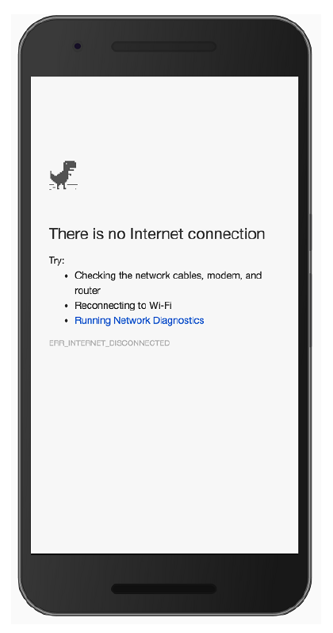
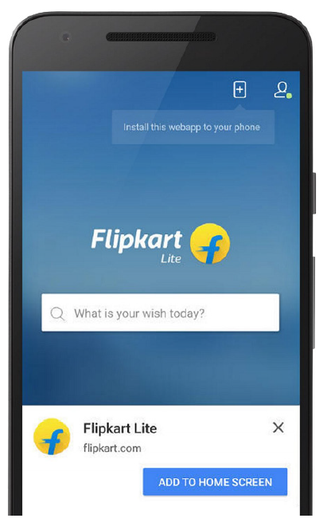

## 1.1 PWA 有什么优势？

在我们开始探索为什么 PWA 对于当今 Web 世界是个重大飞跃之前，值得回忆下自 Web 问世以来的历程。这要追溯到1990年的圣诞节，Tim Berners-Lee 爵士和他在 CERN 的团队创建了工作网络所需的所有工具，他们创建了 HTTP、HTML 和 WorldWideWeb (全世界第一个网页浏览器)。WorldWideWeb 只能运行由超链接的简单纯文本组成的网页。事实上，这些第一代的网页仍然在线，并且可以浏览！

回到现在，我们所浏览的网页与最初的网页并没有太大的不同。当然，现在我们有了像 CSS 和 Javacript 这样的功能，但网页的核心依旧是使用 HTML、HTTP 以及一些其他构建模块来构建的，这些都是 Tim Berners-Lee 及他的团队在多年前所创建的。这些辉煌的构建模块意味着 Web 已经能够以惊人的速度增长。然而，我们用来访问网页的设备数量也在不断增长。无论你的用户是在旅途中还是坐在书桌前，他们都无时无刻不在获取信息。我们对于 Web 的期望从未如此之高。

虽然我们的移动设备变得愈发强大，但我们的移动网络并不是总能满足需求。如果你使用智能手机，你就会知道移动连接是有多么的脆弱。2G、3G 或 4G 这些连接本身都很不错，但是它们时常会失去连接，或者网速变得很差。如果你的业务是跟网络相关的，那这就是你需要去解决的问题。

从历史上来说，原生应用 (下载到手机的) 已经能够提供更好的整体用户体验，你只要下载好原生应用，它便会立即加载。即使没有网络连接，也并非是完全不可用的: 你的设备上已经存储了供用户使用的绝大部分资源。原生应用具备提供有弹性、吸引人的体验的能力，同时也意味它的数量已经呈爆炸式增长。目前在苹果和 Google 的应用商店中，已经有超过400万的原生应用！

从历史上来说，Web 无法提供原生应用所具备的这些强大功能，比如离线能力，瞬时加载和更高的可靠性。这也正是 PWA 成为 Web 颠覆者的契机。主要的浏览器厂商一直在努力改进构建 Web 的方式， 并创建了一组新功能以使 Web 开发者能够创建快速、可靠和吸引人的网站。PWA 应该具备以下特点：

  * 响应式
  * 独立于网络连接
  * 类似原生应用的交互体验
  * 始终保持更新
  * 安全
  * 可发现
  * 可重连
  * 可安装
  * 可链接

作为 Web 开发者，这是我们传统构建网站方式的一种转变。这意味着我们可以开始构建可以应对不断变化的网络条件或无网络连接的网站。这还意味着我们可以建立更吸引人的网站来为我们的用户提供一流的浏览体验。

读到这，你可能会想，这太疯狂了！那些不支持这些新功能的老浏览器怎么办？ PWA 最棒的一点就是它们真的是“渐进式”的。如果你构建一个 PWA，即使在一个不支持的老旧浏览器上运行，它仍然可以作为一个普通的网站来运行。驱动 PWA 的技术就是这样设计的，只有在支持这些新功能的浏览器中才会增强体验。如果用户的设备支持，那么他们将获得所有额外的好处和更多的改进功能。无论怎样，这对你和你的用户来说都是双赢！

### 1.1.1 基础

那么 PWA 到底是由什么组成的呢？我们一直将它们作为一组功能和原理来讨论，但真正使某个网站成为 “PWA” 的到底是什么呢？最最简单的 PWA 其实只是普通的网站。它们是由我们这些 Web 开发者所熟悉和喜欢的技术所创建的，即 HTML、CSS 和 JavaScript 。然而， PWA 却更进一步，它为用户提供了增强的体验。我非常喜欢 Google Chrome 团队的开发人员 Alex Russell 的描述方式：

> _“这些应用没有通过应用商店进行打包和部署，它们只是汲取了所需要的原生功能的网站而已。”_

PWA 会指向一个清单 (manifest) 文件，其中包含网站相关的信息，包括图标，背景屏幕，颜色和默认方向。(在第5章中，你将学习到如何使用清单文件来使你的网站更加吸引人)

PWA 使用了叫做 Service Workers 的重要新功能，它可以令你深入网络请求并构建更好的 Web 体验。随着本章的深入，我们将进一步了解它们以及它们带给浏览器的改进。PWA 还允许你将其“添加”到设备的主屏幕上。它会像原生应用那样，通过点击图标便可让你轻松访问一个 Web 应用。(我们将在第5章中深入讨论)

PWA 还可以离线工作。使用 Service Workers，你可以选择性地缓存部分网站以提供离线体验。如果你现在在没有网络连接的情况下浏览网站，那么对于绝大多数网站，你看到的应该是类似于下面图1.1所示的样子。

**图1.1 作为用户，离线页面可能会非常令人沮丧，尤其是迫切需要获取这些信息时！**

有了 Service Workers，我们的用户无需再面对恐怖的“无网络连接”屏幕了。使用 Service Workers，你可以拦截并缓存任何来自你网站的网络请求。无论你是为移动设备，桌面设备还是平板设备构建网站， 都可以在有网络连接或没有网络连接的情况下控制如何响应请求。(我们将在第3章中深入了解缓存，并在第8章中构建一个离线网页。)

简而言之，PWA 不仅仅是一组非常棒的新功能，它们实际上是我们构建更好的网站的一种方式。PWA 正在迅速成为一套最佳实践。构建 PWA 所采取的步骤将有利于访问你网站的任何人，无论他们选择使用何种设备。

一旦你解锁了开始构建 PWA 所需的基本构建块，你会很快发现，比较高级的例子并没有看上去那么高级。对于不知情的外行人来说，这本书可能看起来无足轻重，但是一旦你进入构建 PWA 的节奏后，你会发现一切都是如此的简单！

### 1.1.2 构建 PWA 的业务场景

作为一名开发者，我当然知道当一项新技术或一系列功能出现时，是有多么的令人兴奋。但为你的网站发掘并引进最新最好的库或框架的强烈欲望往往会掩盖其为企业带来的价值。无论你是否相信，PWA 能实际上为我们的用户带来真正的价值，并使网站更具吸引力，更有弹性，甚至更快。

PWA 最棒的一点是可以一步步地来增强现有的 Web 应用。我们在本书中学习的技术集合可以应用于任何现有的网站，甚至是你正在构建的新的 Web 应用。无论你选择何种技术栈来开发网站，PWA 都将与你的解决方案紧密结合在一起，因为它只是简单地基于 HTML、CSS 和 JavaScript 。这简直太棒了！

现在你对 PWA 已经有了基本的了解，让我们先暂时停下脚步，想象一下用 PWA 来构建的各种可能性。假设你的在线业务是报纸，人们通过它来了解更多关于当地的新闻。如果你知道有人经常访问你的网站并浏览多个页面，为什么不提前缓存这些页面，这样他们就可以完全离线地浏览新闻？或者想象下，你的 Web 应用服务于一个慈善机构，志愿者们在这个网络连接不稳定或压根无网络连接的区域进行工作。PWA 的功能将允许你构建一个离线应用，使他们在没有网络连接的现场也能收集信息。一旦他们回到办公室或有网络连接的区域，数据就可以同步到服务器。对于 Web 开发者来说，PWA 是个彻底的颠覆者，并且我个人对它们将带给 Web 的功能感到兴奋不已。

在本章的前面，我提到了你可以将 PWA “添加” 到设备的主屏幕上。一旦添加后，它便会出现在你的主屏幕上并可以通过点击图标来访问你的网站。可以把它当做台式机的快捷方式，以使你轻松访问网站。

2015年，印度最大的电商网站 Flipkart 开始构建 Flipkart Lite，它是 Web 和 Flipkart 原生应用完美结合的 PWA 。如果你在浏览器中打开 flipkart.com，你会明白为什么这个网站是如此成功。就用户体验来说是令人印象深刻的，网站的速度很快，可以离线工作，并且用起来使人愉悦。通过将它的网站构建成 PWA，Flipkart 能够显示“添加到主屏幕” 操作栏。

无论你是否相信，通过“添加到主屏幕”图标到达的用户实际上在网站上购买的可能性高达70％！！ (参见图 1.2)

**图1.2 添加到主屏幕功能是重新与用户接触的好方法。**

任何进入苹果或 Google 应用商店的新原生应用可能看起来就像沙滩上的一粒沙。截至2016年6月，在这些商店中始终保持将近200万个应用。如果你开发了一个原生应用，那么它很容易就被应用商店中的海量应用所掩盖。然而，由于 PWA 只是汲取了丰富功能的网站，因此可以通过搜索引擎轻松发现。人们可以很自然地通过社交媒体链接或浏览网页发现 PWA。构建 PWA 可以让你接触比单独使用原生应用更多的人，因为它们是为任何能够运行浏览器的平台而构建的！

PWA 另一个很棒的点是它们是用 Web 开发者所熟悉和喜爱的技术所构建的。CSS、JavaScript 和 HTML 都是构建 PWA 的基石。我个人在一家小型创业公司工作，我知道编写一个可以在多个平台 (iOS、Android 和网站) 上运行的应用是多么的昂贵。有了 PWA，你只需要一个了解 Web 语言的开发团队即可。它使得招聘更容易，而且肯定便宜得多！这并不是说你不应该构建原生应用，因为不同的用户会有不同的需求，但只要你想的话，你可以专注于为网络上的用户营造一个相当好的体验并使他们留下来。

当涉及到 Web 的构建时，用户可以轻松访问你网站的一部分，而无需先下载庞大的文件。使用正确的缓存技术的 PWA 可以保存用户数据并立即为用户提供功能。随着世界各地越来越多的用户开始上网，为下一个十亿人构建网站从未如此重要。PWA 通过构建快速、精简的 Web 应用来帮助你实现此目标。

如果你在当今的网络上阅读过一些软件开发文章的话，常常会有围绕“原生 vs. Web”的争论。哪个更好？各自的优势与劣势是什么？ 原生应用本身是非常好的，但事实是 PWA 不仅仅是将原生的功能引入 Web 。它们解决了企业面临的真正问题，旨在为用户创造一个名副其实的可发现、快速和有吸引力的体验。