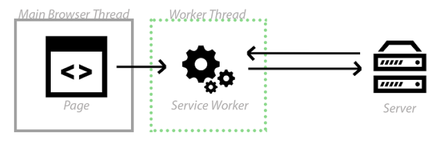
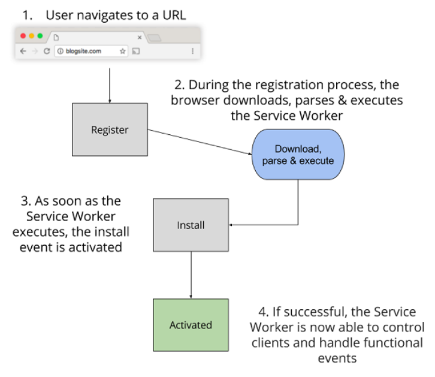
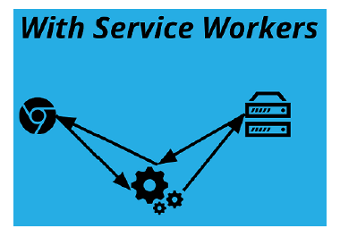

## 1.2 Service Workers: PWA 的关键

正如我之前所提到的，释放 PWA 力量的关键在于 Service Workers 。就其核心来说，Service Workers 只是后台运行的 worker 脚本。它们是用 JavaScript 编写的，只需短短几行代码，它们便可使开发者能够拦截网络请求，处理推送消息并执行许多其他任务。

首先，如果用户的浏览器不支持 Service Workers 的话，它们只是简单地回退，你的网站还作为普通的网站。正是由于这一点，它们被描述为“完美的渐进增强”。渐进增强术语是指你可以先创建能在任何地方运行的体验，然后为支持更高级功能的设备增强体验。

### 1.2.1 理解 Service Workers

Service Worker 是如何...工作的呢？那么为了尽可能地简单易懂，我真的很想解释下 Google 的 Jeff Posnick 是如何描述他们的：

> “将你的网络请求想象成飞机起飞。Service Worker 是路由请求的空中交通管制员。它可以通过网络加载，或甚至通过缓存加载。”

作为“空中交通管制员”，Service Workers 可以让你全权控制网站发起的每一个请求，这为许多不同的使用场景开辟了可能性。空中交通管制员可能将飞机重定向到另一个机场，甚至延迟降落，Service Worker 的行为方式也是如此，它可以重定向你的请求，甚至彻底停止。

虽然 Service Workers 是用 JavaScript 编写的，但需要明白它们与你的标准 JavaScript 文件略有不同，这一点很重要。Service Worker:

  * 运行在它自己的全局脚本上下文中
  * 不绑定到具体的网页
  * 无法修改网页中的元素，因为它无法访问 DOM
  * 只能使用 HTTPS

你无需成为 JavaSript 专家后才可以开始尝试 Service Workers 。它们是事件驱动的，你可以简单地选择想要进入的事件。当你对这些不同的事件有了基本的了解后，开始使用 Service Workers 要比你想象中简单！

为了更好地解释 Service Workers，我们来看看下面的图1.3。



**图1.3 Service Workers 能够拦截进出的 HTTP 请求，从而完全控制你的网站。**

Service Worker 运行在 worker 上下文中，这意味着它无法访问 DOM，它与应用的主要 JavaScript 运行在不同的线程上，所以它不会被阻塞。它们被设计成是完全异步的，因此你无法使用诸如同步 XHR 和 localStorage 之类的功能。在上面的图1.3中，你可以看到 Service Worker 处于不同的线程，并且可以拦截网络请求。记住，Service Worker 就像是“空中交通管制员”，它可以让你全权控制网站中所有进出的网络请求。这种能力使它们及其强大，并允许你来决定如何响应请求。

### 1.2.2 Service Worker 生命周期

在深入代码示例之前，理解 Service Worker 在其生命周期中经历的不同阶段很重要。为了更好的进行解释，让我们想象一下一个已经建好的基础网站，并且该网站使用了 Service Worker 。该网站是一个流行的博客平台，数以百万计的作家每天都在使用它来分享内容。

简单点说，该网站不停地在接收包括图像甚至视频在内的内容请求。为了理解 Service Worker 生命周期是如何工作的，我们从网站每一天数百万次交互请求中挑选出一个。

图1.4展示了 Service Worker 生命周期，它会在用户访问该网站的博客页面时发生。



**图1.4 Service Worker 生命周期**

让我们慢慢来理解上面的图1.4，一步步地了解 Service Worker 生命周期是如何工作的。

当用户首次导航至 URL 时，服务器会返回响应的网页。在图1.4中，你可以看到在第1步中，当你调用 register() 函数时， Service Worker 开始下载。在注册过程中，浏览器会下载、解析并执行 Service Worker (第2步)。如果在此步骤中出现任何错误，register() 返回的 promise 都会执行 reject 操作，并且 Service Worker 会被废弃。

一旦 Service Worker 成功执行了，install 事件就会激活 (第3步)。Service Workers 很棒的一点就是它们是基于事件的，这意味着你可以进入这些事件中的任意一个。我们将在本书的第3章中使用这些不同的事件来实现超快速缓存技术。

一旦安装这步完成，Service Worker 便会激活 (第4步) 并控制在其范围内的一切。如果生命周期中的所有事件都成功了，Service Worker 便已准备就绪，随时可以使用了！



**图1.5 Service Worker 生命周期经历了不同阶段，这有点像交通灯系统**

对我个人而言，我觉得记住 Service Worker 生命周期最简单的方法就是把它当成一组交通信号灯。在注册过程中，Service Worker 处于红灯状态，因为它还需要下载和解析。接下来，它处于黄灯状态，因为它正在执行，还没有完全准备好。如果上述所有步骤都成功了，你的 Service Worker 在将处于绿灯状态，随时可以使用。

需要注意的是，当第一次加载页面是，Service Worker还没有被激活，所以这时Service Worker并不会任何的请求。只有当它安装和激活后，才能控制在其范围内的一切。这意味着，只有你刷新页面或者导航到另一个页面，Service Worker 内的逻辑才会启动。

### 1.2.3 Service Worker 基础示例

我很肯定，到目前为止你一直迫切地想看看代码应该是怎么样的，所以我们开始吧。

因为 Service Worker 只是运行在后台线程的 JavaScript 文件，所以在 HTML 页面中你可以像引用任何 JavaScript 文件一样来引用它。假设我们创建了一个 Service Worker 文件，并将其命名为 sw.js 。要注册它，需要在 HTML 页面中使用如下代码。(参加代码清单 1.1)

##### 代码清单 1.1

```html
<html>
  <head>The best web page ever</head>
  <body>
  <script>
    // 注册 service worker
    if ('serviceWorker' in navigator) {                                                                ❶
      navigator.serviceWorker.register('/sw.js').then(function(registration) {                         ❷
        // 注册成功
        console.log('ServiceWorker registration successful with scope: ', registration.scope);         ❸
      }).catch(function(err) {                                                                         ❹
        // 注册失败 :(
        console.log('ServiceWorker registration failed: ', err);
      });
    }
  </script>
  </body>
</html>
```

* ❶ 检查当前浏览器是否支持 Service Workers
* ❷ 如果支持，注册一个叫做 'sw.js' 的 Service Worker 文件
* ❸ 如果成功则打印到控制台
* ❹ 如果发生错误，捕获错误并打印到控制台

在 script 标签内，我们首先检查浏览器实际上是否支持 Service Workers 。如果支持，我们就使用 `navigator.serviceWorker.register('/sw.js')` 函数注册，该函数又会通知浏览器下载 Service Worker 文件。如果注册成功，它会开始 Service Worker 生命周期的剩余阶段。

在上面的代码示例中，你或许会注意到 JavaScript 代码并没有使用回调函数。那是因为 Service Workers 使用 JavaScript 中的 Promises，Promises 以一种十分整洁、可读的方式来处理回调函数。Promise 表示一个操作还未完成，但是期待它将来会完成。这使得异步方法返回的值如同同步方法那样，并使编写的 JavaScript 更整洁，也更容易阅读。Promises 可以做很多事情，但就目前而言，你所需要知道的就是，如果某些函数返回 Promise，你可以在后面附加 .then()，then 里面包含成功的回调、失败的回调，等等。我们将在后面的章节中更密切地关注 JavaScript 中的 Promises 。

`navigator.serviceWorker.register()` 函数返回 promise，如果注册成功的话，我们可以决定如何继续进行。

之前我提到过 Service Workers 是事件驱动的，而且 Service Workers 最强大的功能之一就是允许你通过进入 fetch 事件来监听任何网络请求。当一个资源发起 fetch 事件时，你可以决定如何继续进行。你可以将发出的 HTTP 请求或接收的 HTTP 响应更改成任何内容。这相当简单，但同时却非常强大！

假设你的 Service Worker 文件中的代码片段如下。(参见代码清单1.2)

##### 代码清单 1.2

```javascript
self.addEventListener('fetch', function(event) {     ❶
  if (/\.jpg$/.test(event.request.url)) {            ❷
    event.respondWith(fetch('/images/unicorn.jpg')); ❸
  }
});
```

* ❶ 为 fetch 事件添加事件监听器
* ❷ 检查传入的 HTTP 请求是否是 JPEG 类型的图片
* ❸ 尝试获取独角兽的图片并用它作为替代图片来响应请求

在上面的代码中，我们监听了 fetch 事件，如果 HTTP 请求的是 JPEG 文件，我们就拦截请求并强制返回一张独角兽图片，而不是原始 URL 请求的图片。上面的代码会为该网站上的每个 JPEG 图片请求执行同样的操作。虽然独角兽的图片棒极了，但是你可能不想在现实世界的网站上这样做；独角兽棒极了，但你的用户可能不满意这样的结果！上面的代码示例可以让你了解 Service Workers 的能力。只是短短几行代码，我们在浏览器中创建了一个强大的代理。

### 1.2.4 安全考虑

为了让 Service Worker 能在网站上运行，需要通过 HTTPS 来提供服务。虽然这让使用它们变得有些困难，但这样做有一个很重要的原因。还记得将 Service Worker 比喻成空中交通管制员吗？能力越大，责任越大，对于 Service Worker 而言，它们实际上也可能用于恶意的用途。如果有人能够在你的网页上注册一个狡诈的 Service Worker，他们将能够劫持连接并将其重定向到恶意端点。事实上，坏蛋们可能会利用你的 HTTP 请求做任何他们想要的事情！为了避免这种情况发送，Service Worker 只能在通过 HTTPS 提供服务的网页上注册。这确保了网页在通过网络的过程中没有被篡改。

如果你是一个想要构建 PWA 的网站开发者，读到这你可能会有点沮丧，千万别！传统上，为你的网站获取 SSL 证书可能会花费了相当多的钱，但不管你是否相信，实际上现在有许多免费的解决方案可以供 Web 开发者使用。

首先，如果你想要在自己的电脑上测试 Service Workers，你可以通过 localhost 提供的页面来执行此操作。它们已经创建了这个功能，以使开发者在部署应用之前轻松进行本地调试。

如果你准备好将你的 PWA 发布到网上，那么你可以使用一些免费的服务。Let’s Encrypt [https://letsencrypt.org/](https://letsencrypt.org/) 是一个新的证书授权，它是免费的、自动的和开放的。你可以使用 Let’s Encrypt 来快速开始让的你网站通过 HTTPS 提供服务。如果你想了解更多关于 Let’s Encrypt 的信息，去它们的“新手入门”页面 [https://letsencrypt.org/getting-started/](https://letsencrypt.org/getting-started/)。

如果像我一样，你使用 GitHub 进行源代码控制的话，那么你可以使用GitHub Pages进行Service Worker的测试 。(参见图1.6) 透过Github Pages，你可以直接在你的 GitHub 仓库中托管基础网站，而无需后端。


**图1.6 GitHub Pages 允许你通过 SSL 直接在 GitHub 仓库中托管网站。**

使用 GitHub Pages 的优点是，默认情况下，你的网页是通过 HTTPS 来提供的。当我第一次开始试用 Service Workers 时，GitHub Pages 允许我快速地启动一个网站，并随时验证我的想法。
