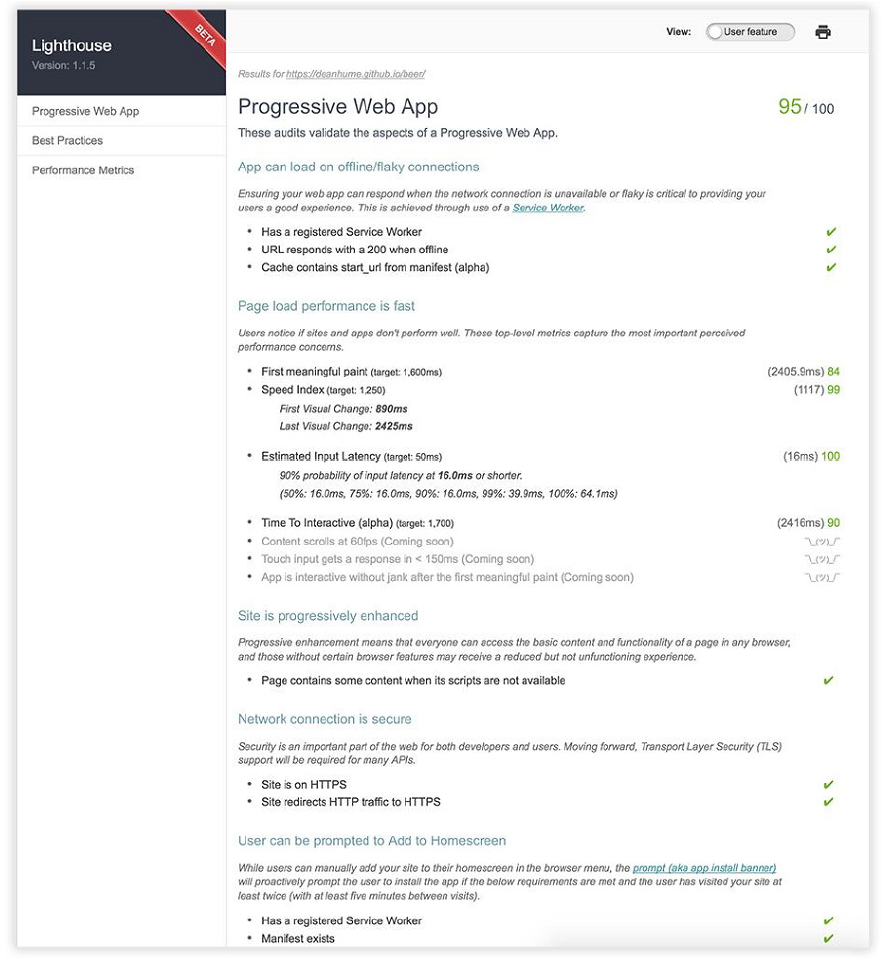

## 2.1 建立在现有基础之上

第1章中 Alex Russell 的引言 (关于汲取了所需要的所有原生功能的网站) 完美地总结了 PWA 的特性，而且我首次开始尝试 Service Workers 时也是这种感觉。当我真正理解了它们工作的基本概念后，我慢慢地意识到它们的强大其实远远超乎我的想象，甚至让我脑洞大开。随着我开始越来越多地了解 PWA，并开始尝试使用每个新功能或“元素”，每次一个。学习任何新技术时，通常就像是在爬山。但是，如果你以每次学习一个功能的思维方式来学习 PWA 相关的知识的话，那么你将很快掌握 PWA 的艺术。

我相信很多读这本书的人都会在你目前的项目中花费大量的时间和精力。幸运的是，构建一个 PWA 并不意味着你必须从头开始把项目再重做一遍。当我尝试改善现有的应用时，每当我觉得一个功能对用户有益并能为他们提供增强的体验时，我就会添加这个新“功能”。我喜欢把每个 PWA 的新功能都看作是超级马里奥每次吃新蘑菇时的升级！

如果你有一个现有的 Web 应用，你认为它可以从 PWA 的功能中受益，我推荐看看一个叫做 Lighthouse ([https://github.com/GoogleChrome/lighthouse](https://github.com/GoogleChrome/lighthouse)) 的便利工具。它提供 Web 应用相关的有用的性能信息和审核信息。(参见图2.1)

**图2.1 Lighthouse 工具非常适用于衡量 PWA 的审核和生产性能。**

你也可以把它当做命令行界面来使用，或者你使用 Google Chrome 浏览器的话，还有方便的 Chrome 插件可以使用。如果你在打开网站时运行它，它会生成与上面图片类似的内容。该工具针对你的网站进行审核，并生成一个有用的功能和性能指标清单，可用于改进你的网站。如果你想使用这个方便的工具并将其运行到你现有的一个
网站上，请移步至 [github.com/GoogleChrome/lighthouse](github.com/GoogleChrome/lighthouse) 以了解更多信息。

有了 Lighthouse 工具的反馈，你可以每次添加一个新功能，慢慢地提升你网站的整体体验。

此刻，你可能会想知道有哪些功能是你可能想要添加到现有网站上的！ Service Workers 开辟了一个充满可能性的世界，所以决定从哪里入手是比较棘手的。在本书的其余部分，每章将重点介绍 PWA 的一个新功能，无论你是为现有网站构建，还是为一个全新的网站，都可以即学即用。
