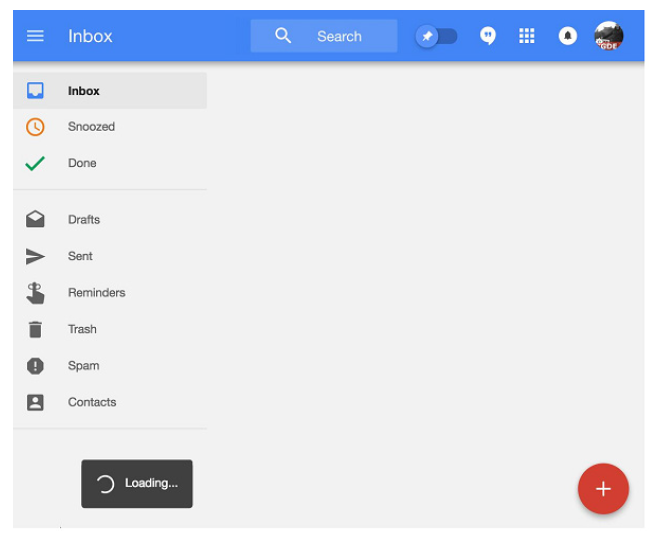
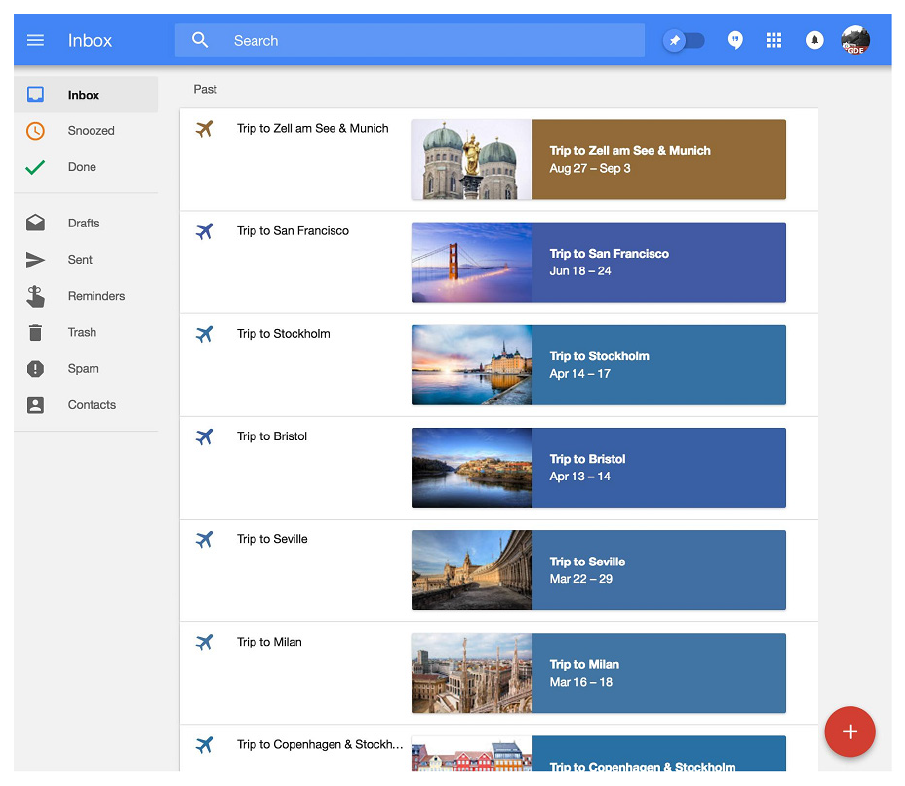
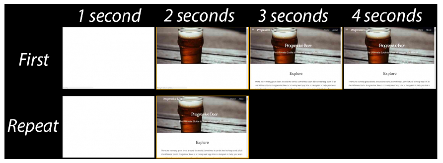
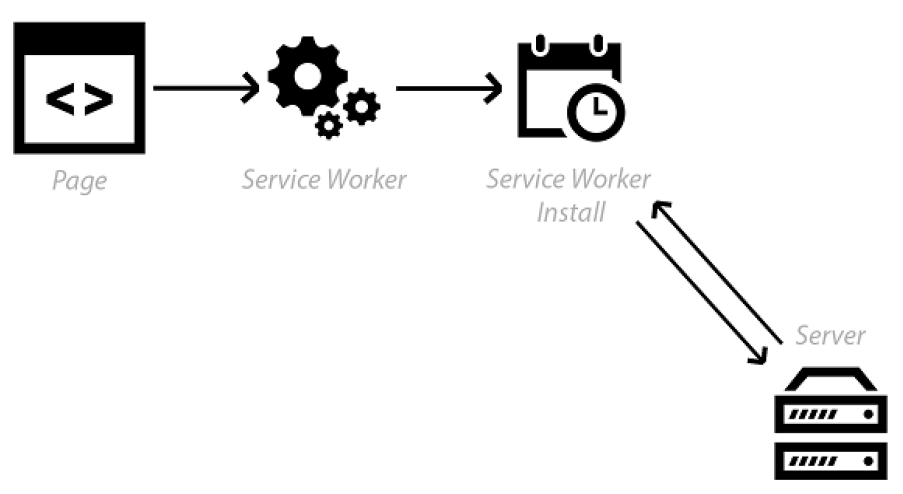
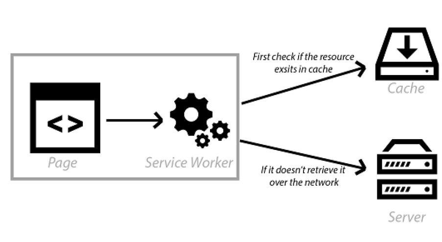

## 2.2 构建 PWA 的前端架构方式

在开发者之中，通常会讨论是构建原生应用还是 Web 应用，到底哪个更好。就我个人而言，我认为你应该根据用户的需要来构建应用。不应该出现 PWA 和原生应用相争的状况，作为开发者，我们应该不断探索提升用户体验的方法。就像你想的那样，我会对构建 Web 应用有自己的偏好，但无论你是否喜欢，如果你将 PWA 视为一套“最佳”实践的话，你都会构建出更好的网站。假设说，你喜欢用 React 或 Angular 进行开发，你完全可以继续使用它们，因为构建 PWA 只会增强 Web 应用，并使其速度更快，更具吸引力和更有弹性。

原生应用开发者长期以来一直能够给他们的用户提供 Web 开发者梦寐以求的功能，例如离线操作和无论网络连接如何都可以响应的功能。然而，要感谢 PWA 带给 Web 的新功能，我们可以努力构建更好的网站。许多原生应用都有着良好的架构，作为 Web 开发者，我们可以从他们的架构方法中进行学习。在下一节中，我们会来看看构建 PWA 时，在前端代码中可以使用的不同架构方式。

### 2.2.1 应用外壳架构

当今有很多非常棒的原生应用。就个人而言，我觉得 Facebook 的原生应用为用户提供了非常棒的体验。当你离线时它会给你提示，它会缓存你的时间轴，以便你能更快地访问，它还能做到瞬间加载。如果你有一段时间没有访问 Facebook 的原生应用，你仍会在任何动态内容加载之前，立即看到一个空的“UI 外壳”，包括头部和导航条。

借助 Service Workers 的力量，我们没有任何理由不为 Web 上的用户提供同样的体验。使用智能的 Service Worker 缓存，你实际上可以缓存你网站的 UI 外壳，以便用户重复访问。这些新功能使我们能够以不同的方式来思考和构建网站。

此刻你可能想知道什么是 “UI 外壳”：它只是用户界面所必需的最小化的 HTML、CSS 和 JavaScript 。它可能会是类似网站头部，底部和导航这样没有任何动态内容的部分。如果我们能加载并缓存 UI 外壳，我们就可以在稍后的阶段将动态内容加载到页面中。Google 的 Inbox 就是一个很好的现成例子。我们来看看下面的图片，以获得更好的理解。

**图2.2 Google 的 Inbox 利用 Service Workers 来缓存 UI 外壳。**

你可能对 Google 的 Inbox 已经很熟悉了。(参见图2.2) 它是一个便利的 Web 应用，它允许你组织和发送邮件。在底层它使用 Service Workers 来缓存，并为用户提供超级快的体验。如你在上图中所见，当你访问该网站的时候，首先它的 UI 外壳会立即呈现在你眼前。这是非常棒的，因为用户获得了即时反馈，这会让他们感到网站速度非常快，即使我们仍在等待其余部分的动态内容加载。该应用给用户一种感观上的速度快，即使它用来获取内容的时间并不比之前短。用户还会注意到 “loading” 指示符，它表示网站正在发生一些事情，此刻正忙。这比等待一个空白页面加载很久好多了！

一旦外壳加载完，网站的动态内容就会使用 JavaScript 来获取并加载。

**图2.3 一旦 UI 外壳加载完，就可以获取网站的动态内容，然后添加到页面的剩余部分。**

上面的图2.3展示了 Google 的 Inbox 网站在动态内容加载完后就会将其填充到 Web 应用之中。使用同样的技术，你可以为网站的重复访问提供瞬时加载，还可以缓存应用的 UI 外壳，这样它就能离线工作。这样即使用户当前没有连接，他们也可以看到应用的 UI 外壳。

在第3章中，你将学习如何利用 Service Workers 来缓存你的内容并且为你的用户提供离线体验。在本书中，我们会构建一个 PWA，它会使用应用外壳架构，你可以下载并遵循此代码，然后使用此方法来构建你自己的应用。

#### 性能优势

使用了应用外壳架构的 Web 应用“瞬时”加载说起来很容易，但这对用户到底意味着什么呢？多快才是“瞬时”？为了更好的从视觉上感受出使用应用外壳架构的 PWA 加载有多块，我使用了叫做 webpagetest.org 的工具来生成下面的幻灯片。(参见图2.4)

**图2.4 即使在动态内容加载完成之前，应用外壳架构也可以在屏幕上为用户提供有意义的内容。上图显示了使用 Service Workers 进行缓存前后的加载时间。**

我对我构建的名为 Progressive Beer 的 PWA 运行该工具。上图显示了一段时间内 PWA 加载的幻灯片视图。在图像的顶部，你可以看到以秒为单位的时间及其对应的屏幕上的页面显示情况。

对于首次访问的用户，该网站需要更长时间进行下载，因为是首次获取这些资源。一旦所有的资源下载完成，首次访问的用户大约在4秒后能够在与网站进行充分的互动。

对于再次访问的用户，激活的 Service Worker 便会进行安装，用户大概会在0.5秒 (500毫秒) 后看到网站的 UI 外壳。尽管动态内容还没有从服务器返回，但 UI 外壳会首先加载。此后，剩余的动态内容会被加载并填充到屏幕之中。此方法最棒的是，即使没有网络连接，用户仍然可以在大约500毫秒后看到网站的 UI 外壳。此刻，我们可以向他们展示一些有意义的东西，要么通知他们处于离线状态，要么为他们提供缓存的内容。

记住，每次用户重新访问网站，他们都会体验到这种快速、可靠和有吸引力的增强体验。如果你即将开发一个新的 Web 应用的话，使用应用外壳架构会是一种利用 Service Workers 的高效方式。

#### 应用外壳架构实战

在第1章中，我们经历了 Service Worker 生命周期的各个阶段。起初，它可能没有太多的意义，但随着我们深入了解应用外壳架构是如何工作的，它便开始有意义了。记住，使用 Service Worker 你便能够进入它生命周期的各个不同事件。

为了更好的理解如何进入这些事件，我们来看看下面的图2.5。

**图2.5 在 Service Worker 安装过程中，我们可以获取资源并为下次访问做好预缓存。**

当用户首次访问网站时，Service Worker 会开始下载并安装自身。在安装阶段，我们可以进入这个事件并准备缓存 UI 外壳所需的所有资源。也就是说，基础的 HTML 页面和任何可能需要的 CSS 或 JavaScript 。

此时，我们可以立即提供网站的“外壳”，因为它已经添加到 Service Worker 缓存之中。这些资源的 HTTP 请求再也不需要转到服务器了。一旦用户导航到另一个页面，他们将立即看到外壳。(参见图2.6)

**图2.6 对于发起的任意 HTTP 请求，我们可以检查资源是否存在于缓存之中，如果不存在的话，我们再通过网络来获取它们。**

动态内容被加载到网站中，网站会正常运行。因为你能够进入这些请求的 fetch 事件，所以你可以决定是否要缓存它们。你可能有经常更新的动态内容，因此缓存它们没有意义。但是，你的用户仍然会得到更快、更好的浏览体验。在下章中，我们会深入 Service Worker 缓存，在那里你将了解到更多关于这个强大功能的具体内容。