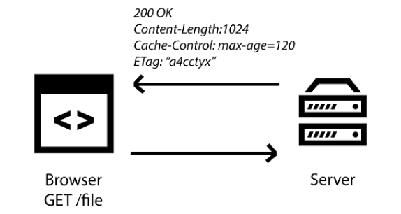

## 3.1 HTTP 缓存基础

现代浏览器真的十分聪明，它们可以解释和理解各种 HTTP 请求和响应，并且能够在需要数据之前进行存储和缓存。我喜欢将浏览器缓存信息的能力看作牛奶上的最迟销售日期。同样的方式，你可以将牛奶保存在冰箱中，直至到达保质期，浏览器也可以在一段时间内缓存网站相关的信息。在过期后，它会去获取更新后的版本。这可以确保网页加载更快并消耗更少的带宽。

在深入 Service Worker 缓存之前，先后退一步，了解下传统 HTTP 缓存的工作原理是很重要的。自从20世纪90年代初引入 HTTP/1.0 以来，Web 开发者便已经能够使用 HTTP 缓存了。HTTP 缓存允许服务器发送正确的 HTTP 首部，这些首部信息将指示浏览器在一段时间内缓存响应。

Web 服务器可以利用浏览器的能力来缓存数据，并使用它来减少重复请求的加载时间。如果一个用户在一次会话中访问同一个页面两次，如果数据没有改变，通常不需要为它们提供新的资源。这样一来，Web 服务器可以使用 Expires 首部来通知 Web 客户端，它可以使用资源的当前副本，直到指定的“过期时间”。反过来，浏览器可以缓存此资源，并且只有在有效期满后才会再次检查新版本。

**图3.1 当浏览器发起一个资源的 HTTP 请求时， 服务器会发送的 HTTP 响应会包含该资源相关的有用信息**

在上图中，你可以看到当浏览器发起一个资源的 HTTP 请求时，服务器返回的资源还附带一些 HTTP 首部。这些首部包含有用的信息，浏览器可以通过它们来了解资源相关的更多信息。HTTP 响应告诉浏览器这个资源是什么类型的，要缓存多长时间，它是否压缩过，等等。

HTTP 缓存是提高网站性能的绝佳方式，但它也有自身的缺陷。使用 HTTP 缓存意味着你要依赖服务器来告诉你何时缓存资源和何时过期。如果你的内容具有相关性，任何更新都可能导致服务器发送的到期日期很容易变得不同步，并影响你的网站。

能力越大，责任越大， 对 HTTP 缓存来说，真是再正确不过了。当我们对 HTML 进行重大更改时，我们也可能会更改 CSS 以及对应的新的 HTML 结构，并更新任何 JavaScript 以适应样式和内容的更改。如果你曾经在发布更改后的网站时没有得到正确的 HTTP 缓存的话，我相信你会明白这是由于错误的缓存资源所导致的网站被破坏。

下面的图是我的个人博客在文件被错误缓存情况下的样子。

**图3.2 当缓存的文件不同步时，网站的感观都会受其影响**

你可以想象一下，无论是对于开发者还是用户，这都是非常令人沮丧的！在上面的图3.2中，你可以看到页面的 CSS 样式没有加载，这是由于不正确的缓存而导致的文件不匹配。