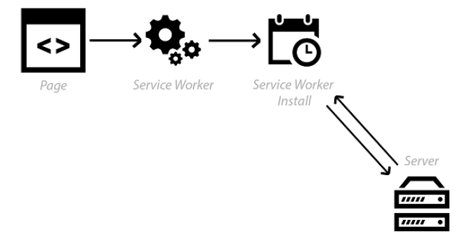
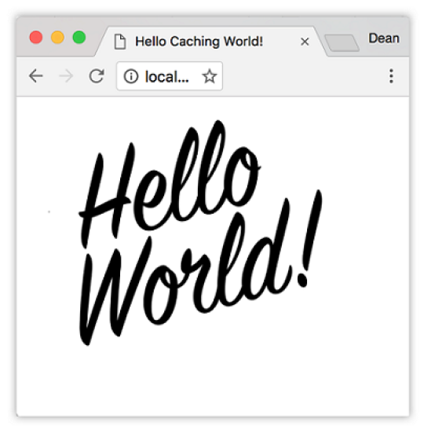
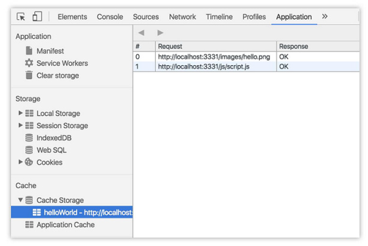
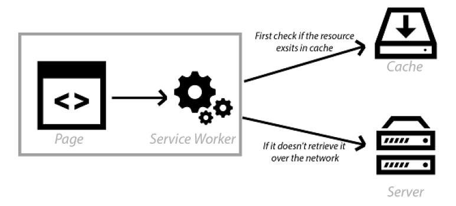
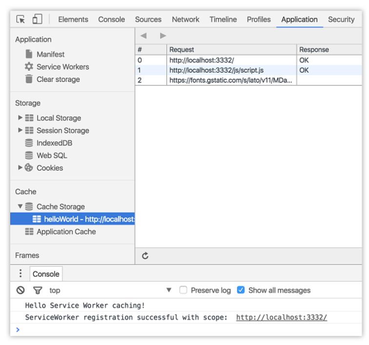
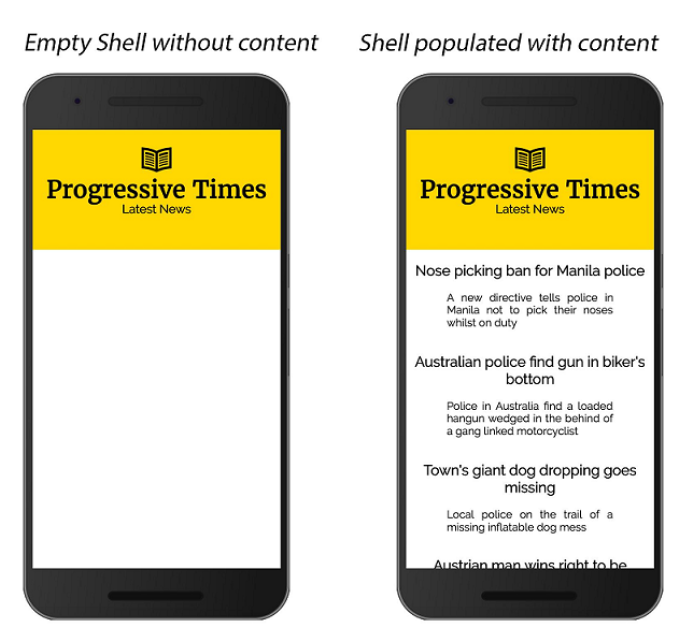

## 3.2 Service Workers 缓存基础

本章读到此处，你可能会思考，我们都已经有 HTTP 缓存了，为何还需要 Service Worker 缓存呢？ Service Worker 缓存有何不同呢？好吧，它可以替代服务器来告诉浏览器资源要缓存多久，作为开发者的你可以全权掌控。Service Worker 缓存极其强大，因为对于如何缓存资源，它赋予了你程序式的精准控制能力。与所有 PWA 的功能一样，Service Worker 缓存是对 HTTP 缓存的增强，并可以与之配合使用。

Service Workers 的强大在于它们拦截 HTTP 请求的能力。在本章中，我们将使用这种拦截 HTTP 请求和响应的能力，从而为用户提供直接来自缓存的超快速响应！

### 3.2.1 在 Service Worker 安装过程中预缓存

使用 Service Workers，你可以进入任何传入的 HTTP 请求，并决定想要如何响应。在你的 Service Worker 中，可以编写逻辑来决定想要缓存的资源，以及需要满足什么条件和资源需要缓存多久。一切尽归你掌控！

在上一章中，我们简要地看过一个示例，如下面图3.3所示。当用户首次访问网站时，Service Worker 会开始下载并安装自身。在安装阶段中，我们可以进入这个事件，并准备缓存 Web 应用所需的所有重要资源。



**图3.3 在 Service Worker 安装阶段，我们可以获取资源并为下次访问准备好缓存**

以此图为例，我们来创建一个基础的缓存示例，以便更好地了解它是如何实际工作的。在下面的清单3.1中，我创建了一个简单的 HTML 页面，它注册了 Service Worker 文件。

##### 代码清单 3.1

```html
<!DOCTYPE html>
<html>
  <head>
    <meta charset="UTF-8">
    <title>Hello Caching World!</title>
  </head>
  <body>
    <!-- Image -->
                       ❶
    <!-- JavaScript -->
    <script async src="/js/script.js"></script>       ❷
    <script>
      // 注册 service worker
      if ('serviceWorker' in navigator) {             ❸
        navigator.serviceWorker.register('/service-worker.js').then(function (registration) {
          // 注册成功
          console.log('ServiceWorker registration successful with scope: ', registration.scope);
        }).catch(function (err) {                     ❹
          // 注册失败 :(
          console.log('ServiceWorker registration failed: ', err);
        });
      }
    </script>
  </body>
</html>
</script>
</body>
</html>
```

* ❶ 引用 “hello” 图片
* ❷ 引用基础的 JavaScript 文件
* ❸ 检查当前浏览器是否支持 Service Workers
* ❹ 如果在 Service Worker 注册期间发生错误，我们可以捕获它并做出适当的处理

在上面的清单3.1中，你可以看到一个引用了图片和 JavaScript 文件的简单网页。该网页没有任何华丽的地方，但我们会用它来学习如何使用 Service Worker 缓存来缓存资源。上面的代码会检查你的浏览器是否支持 Service Worker，如果支持，它会尝试去注册一个叫做 `service-worker.js` 的文件。

好了，我们已经准备好了基础页面，下一步我们需要创建缓存资源的代码。清单3.2中的代码会进入叫做 `service-worker.js` 的 Service Worker 文件。

##### 代码清单 3.2

```javascript
var cacheName = 'helloWorld';                ❶
self.addEventListener('install', event => {  ❷
  event.waitUntil(
    caches.open(cacheName)                   ❸
    .then(cache => cache.addAll([            ❹
      '/js/script.js',
      '/images/hello.png'
    ]))
  );
});
```

* ❶ 缓存的名称
* ❷ 我们将进入 Service Worker 的安装事件
* ❸ 使用我们指定的缓存名称来打开缓存
* ❹ 把 JavaScript 和 图片文件添加到缓存中

在第1章中，我们看过了 Service Worker 生命周期和它激活之前所经历的不同阶段。其中一个阶段就是 install 事件，它发生在浏览器安装并注册 Service Worker 时。这是把资源添加到缓存中的绝佳时间，在后面的阶段可能会用到这些资源。例如，如果我知道某个 JavaScript 文件可能整个网站都会使用它，我们就可以在安装期间缓存它。这意味着另一个引用此 JavaScript 文件的页面能够在后面的阶段轻松地从缓存中获取文件。

清单3.2中的代码进入了 `install` 事件，并在此阶段将 JavaScript 文件和 hello 图片添加到缓存中。在上面的清单中，我还引用了一个叫做 `cacheName` 的变量。这是一个字符串，我用它来设置缓存的名称。你可以为每个缓存取不同的名称，甚至可以拥有一个缓存的多个不同的副本，因为每个新的字符串使其唯一。当看到本章后面的版本控制和缓存清除时，你将会感受到它所带来的便利。

在清单3.2中，你可以看到一旦缓存被开启，我们就可以开始把资源添加进去。接下来，我们调用了 `cache.addAll()` 并传入文件数组。`event.waitUntil()` 方法使用了 JavaScript 的 Promise 并用它来知晓安装所需的时间以及是否安装成功。

如果所有的文件都成功缓存了，那么 Service Worker 便会安装完成。如果任何文件下载失败了，那么安装过程也会随之失败。这点非常重要，因为它意味着你需要依赖的所有资源都存在于服务器中，并且你需要注意决定在安装步骤中缓存的文件列表。定义一个很长的文件列表便会增加缓存失败的几率，多一个文件便多一份风险，从而导致你的 Servicer Worker 无法安装。

现在我们的缓存已经准备好了，我们能够开始从中读取资源。我们需要在清单3.3中添加代码，让 Service Worker 开始监听 fetch 事件。

##### 代码清单 3.3

```javascript
self.addEventListener('fetch', function (event) {  ❶
  event.respondWith(
    caches.match(event.request)                    ❷
    .then(function (response) {
      if (response) {                              ❸
        return response;                           ❹
      }
      return fetch(event.request);                 ❺
    })
  );
});
```

* ❶ 添加 fetch 事件的事件监听器
* ❷ 检查传入的请求 URL 是否匹配当前缓存中存在的任何内容
* ❸ 如果有 response 并且它不是 undefined 或 null 的话就将它返回
* ❹ 否则只是如往常一样继续，通过网络获取预期的资源

清单3.3中的代码是我们 Service Worker 杰作的最后一部分。我们首先为 fetch 事件添加一个事件监听器。接下来，我们使用 `caches.match()` 函数来检查传入的请求 URL 是否匹配当前缓存中存在的任何内容。如果存在的话，我们就简单地返回缓存的资源。但是，如果资源并不存在于缓存当中，我们就如往常一样继续，通过网络来获取资源。

如果你打开一个支持 Service Workers 的浏览器并导航至最新创建的页面，你应该会注意到类似于下图3.4中的内容。



**图3.4 示例代码生成了带有图片和 JavaScript 文件的基础网页**

请求的资源现在应该是可以在 Service Worker 缓存中获取的。当我刷新页面时，Service Worker 会拦截 HTTP 请求并从缓存中立即加载合适的资源，而不是发起网络请求到服务器端。Service Worker 中只需短短几行代码，你便拥有了一个直接从缓存加载的网站，并能立即响应重复访问！

附注一点，Service workers 只能在 HTTPS 这样的安全来源中使用。然而，当开在本机上开发 Service Workers 时，你能够使用 [http://localhost](http://localhost) 。Service Workers 已经建立了这样的方式，以确保发布后的安全，而且同时还兼顾了灵活性，使开发者在本机上工作变得更加容易。

一些现代浏览器可以使用浏览器内置的开发者工具来查看 Service Worker 缓存中的内容。例如，如果你打开 Google Chrome 的开发者工具并切换至 “Application” 标签页，你能够看到类似于下图3.5中的内容。



**图3.5 当你想看缓存中存储什么时， Google Chrome 的开发者工具会非常有用**

图3.5展示了名称为 `helloWorld` 的缓存项中存储了 `scripts.js` 和 `hello.png` 两个文件。现在资源已经存储在缓存中，今后这些资源的任何请求都会从缓存中立即取出。

### 3.2.2 拦截并缓存

在清单3.2中，我们看过了如何在 Service Worker 安装期间缓存任何重要的资源，这被称之为“预缓存”。当你确切地知道你要缓存的资源时，这个示例能很好地工作，但是资源可能是动态的，或者你可能对资源完全不了解呢？例如，你的网站可能是一个体育新闻网站，它需要在比赛期间不断更新，在 Service Worker 安装期间你是不会知道这些文件的。

因为 Service Workers 能够拦截 HTTP 请求，对于我们来说，这是发起请求然后将响应存储在缓存中的绝佳机会。这意味着我们改为先请求资源，然后立即缓存起来。这样一来，对于同样资源的发起的下一次 HTTP 请求，我们可以立即将其从  Service Worker 缓存中取出。



**图3.6 对于发起的任何 HTTP 请求，我们可以检查资源是否在缓存中已经存在，如果没有的话再通过网络来获取**

我们来更新下之前清单3.1中的代码。

##### 代码清单 3.4

```html
<!DOCTYPE html>
<html>
  <head>
    <meta charset="UTF-8">
    <title>Hello Caching World!</title>
    <link href="https://fonts.googleapis.com/css?family=Lato" rel="stylesheet">                        ❶
    <style>
      #body {
        font-family: 'Lato', sans-serif;
      }
    </style>
  </head>

  <body>
    <h1>Hello Service Worker Cache!</h1>
    <!-- JavaScript -->
    <script async src="/js/script.js"></script>                                                        ❷
    <script>
      if ('serviceWorker' in navigator) {                                                              ❸
        navigator.serviceWorker.register('/service-worker.js').then(function (registration) {
          console.log('ServiceWorker registration successful with scope: ', registration.scope);
        }).catch(function (err) {                                                                      ❹
          console.log('ServiceWorker registration failed: ', err);
        });
      }
    </script>
  </body>
</html>
```

* ❶ 添加网络字体的引用
* ❷ 为当前页面提供功能的 JavaScript 文件
* ❸ 首先，我们需要检查浏览器是否支持 Service Workers
* ❹ 如果在 Service Workers 注册期间报错，我们可以捕获它并做出适当的处理

相比较于清单3.1，清单3.4中的代码并没有太大变化，除了我们在 HEAD 标签中添加了一个网络字体的引用。由于这是一个可能会发生变化的外部资源，所以我们可以在 HTTP 请求完成后缓存该资源。你还会注意到，我们用来注册 Service Worker 的代码并没有改变。事实上，除了一些例外，这段代码是注册 Service Worker 想当标准的方式。在本书中，我们会反复使用这段样板代码来注册 Service Worker 。

现在页面已经完成，我们准备开始为 Service Worker 文件添加一些代码。下面的清单3.5展示了我们要使用的代码。

##### 代码清单 3.5

```javascript
var cacheName = 'helloWorld';                                ❶
self.addEventListener('fetch', function (event) {            ❷
  event.respondWith(
    caches.match(event.request)                              ❸
    .then(function (response) {
      if (response) {                                        ❹
        return response;
      }
      var requestToCache = event.request.clone();            ❺
      return fetch(requestToCache).then(                     ❻
        function (response) {
          if (!response || response.status !== 200) {        ❼
            return response;
          }
          var responseToCache = response.clone();            ❽
          caches.open(cacheName)                             ❾
            .then(function (cache) {
              cache.put(requestToCache, responseToCache);    ❿
            });
          return response;
        }
      );
    })
  );
});
```

* ❶ 缓存的名称
* ❷ 为 fetch 事件添加事件监听器以拦截请求
* ❸ 当前请求是否匹配缓存中存在的任何内容？
* ❹ 如果匹配的话，就此返回缓存并不再继续执行
* ❺ 这很重要，我们克隆了请求。请求是一个流，只能消耗一次。
* ❻ 尝试按预期一样发起原始的 HTTP 请求
* ❼ 如果由于任何原因请求失败或者服务器响应了错误代码，则立即返回错误信息
* ❽ 再一次，我们需要克隆响应，因为我们需要将其添加到缓存中，而且它还将用于最终返回响应
* ❾ 打开名称为 “helloWorld” 的缓存
* ❿ 将响应添加到缓存中

清单3.5中的代码看上去好多啊！我们分解来看，并解释每个部分。代码先通过添加事件监听器来进入 fetch 事件。我们首先要做的就是检查请求的资源是否存在于缓存之中。如果存在，我们可以就此返回缓存并不再继续执行代码。

然而，如果请求的资源于缓存之中没有的话，我们就按原计划发起网络请求。在代码更进一步之前，我们需要克隆请求。需要这么做是因为请求是一个流，它只能消耗一次。因为我们已经通过缓存消耗了一次，然后发起 HTTP 请求还要再消耗一次，所以我们需要在此时克隆请求。然后，我们需要检查 HTTP 响应，确保服务器返回的是成功响应并且没有任何问题。我们绝不想缓存一个错误的结果！

如果成功响应，我们会再次克隆响应。你可能会疑惑我们为什么需要再次克隆响应，请记住响应是一个流，它只能消耗一次。因为我们想要浏览器和缓存都能够消耗响应，所以我们需要克隆它，这样就有了两个流。

最后，代码中使用这个响应并将其添加至缓存中，以便下次再使用它。如果用户刷新页面或访问网站另一个请求了这些资源的页面，它会立即从缓存中获取资源，而不再是通过网络。



**图3.7 使用 Google Chrome 的开发者工具，我们可以看到网络字体已经通过网络获取并添加至缓存中，以确保重复请求时速度更快**

如果你仔细看下上面的图3.7，你会注意到页面上三个资源的缓存中有新项。在上面的代码示例中，每次返回成功的 HTTP 响应时，我们都能够动态地向缓存中添加资源。对于你可能想要缓存资源，但不太确定它们可能更改的频率或确切地来自哪里，那么这种技术可能是完美的。

Service Workers 赋予作为开发者的你通过代码进行完全的控制，并允许你轻松构建适合需求的自定义缓存解决方案。事实上，使用我们前面提到的两种缓存技术可以组合起来，以使加载速度更快。完全由你来掌控这一切。

例如，假设你正在构建一个使用应用外壳架构的新 Web 应用。你可能会想要使用我们在清单3.2中的代码来预缓存外壳。对于之后任何的 HTTP 请求都会使用拦截并缓存的技术进行缓存。或者你也许只想缓存现有网站中已知的、不会经常更改的部分。通过简单地拦截并缓存这些资源，就能为用户提供更好的性能，却只需短短几行代码。取决于你的情况，Service Worker 缓存可以适用你的需求，并立即使用户得到的体验所有提升。

### 3.2.3 整合所有代码

到目前为止，我们已经运行的代码示例都是有帮助的，但是单独思考它们并不太容易。在第1章中，我们讨论了可以用 Service Workers 来构建超棒 Web 应用的多种不同方式。报纸 Web 应用便是其中一个，我们可以在现实世界中使用所学到的关于 Service Workers 缓存的一切知识。我将我们的示例应用命名为 'Progressive Times'。该 Web 应用是一个新闻网站，人们会定期访问并阅读多个页面，所以提前保存未来的页面是有意义的，以便它们能够立即加载。我们甚至可以保存网站本身，以便用户可以离线浏览。

我们的示例 Web 应用包含一些来自世界各地的有趣新闻。无论你是否相信，这个新闻网站的所有报道都是真实的，并且有可靠的信息来源！Web 应用包含绝大多数你可以想象的网站元素，比如 CSS、JavaSript 和图片。为了保持示例代码的基础性，我还为每篇文章准备了扁平的 JSON 文件，在现实生活中，这应该指向一个后端端点以获取类似格式的数据。就自身而言，这个 Web 应用并不怎么令人印象深刻，但是当我们开始利用 Service Workers 的能力时，便可以把它提升到一个新的水平。

Web 应用使用应用外壳架构来动态地获取每篇文章的内容并将数据填充到页面上。



**图3.8 Progressive Times 示例应用使用应用外壳架构**

使用应用外壳架构还意味着我们可以利用预缓存技术，为了确保 Web 应用的重复访问能够立即加载。我们还可以假定访问者会点击链接和阅读新闻文章的完整内容。如果当 Service Worker 安装后我们将这些内容缓存，这意味着对于他们下个页面的加载速度会快很多。

让我们把到目前为止在本章在所学的整合起来，并为 Progressive Times 应用添加  Service Worker ，它将预处理重要资源，并缓存任何其他请求。

##### 代码清单 3.6

```javascript
var cacheName = 'latestNews-v1';
// 在安装过程中缓存我们已知的资源
self.addEventListener('install', event => {
  event.waitUntil(
    caches.open(cacheName)
    .then(cache => cache.addAll([                             ❶
      './js/main.js',
      './js/article.js',
      './images/newspaper.svg',
      './css/site.css',
      './data/latest.json',
      './data/data-1.json',
      './article.html',
      './index.html'
    ]))
  );
});
// 缓存任何获取的新资源
self.addEventListener('fetch', event => {                    ❷
  event.respondWith(
    caches.match(event.request, { ignoreSearch: true })      ❸
    .then(function (response) {
      if (response) {
        return response;                                     ❹
      }
      var requestToCache = event.request.clone();
      return fetch(requestToCache).then(                     ❺
        function (response) {
          if (!response || response.status !== 200) {
            return response;
          }
          var responseToCache = response.clone();
          caches.open(cacheName)
            .then(function (cache) {
              cache.put(requestToCache, responseToCache);    ❻
            });
          return response;
        });
    })
  );
});
```

* ❶ 在安装期间打开缓存并存储一组资源进行缓存
* ❷ 监听 fetch 事件
* ❸ 我们想要忽略任何查询字符串参数，这样便不会得到任何缓存未命中
* ❹ 如果我们发现了成功的匹配，就此返回缓存并不再继续执行
* ❺ 如果我们没在缓存中找到任何内容，则发起请求
* ❻ 存储在缓存中，这样便不需要再次发起请求

清单3.6中的代码是安装期间的预缓存和获取资源时进行缓存的组合应用。该 Web 应用使用了应用外壳架构，这意味着我们可以利用 Service Worker 缓存来只请求填充页面所需的数据。我们已经成功存储了外壳的资源，所以剩下的就是来自服务器的动态新闻内容。

这个网页是托管在 Github 的，如果想亲身体验，可以导航至 [bit.ly/chapter-pwa-3](bit.ly/chapter-pwa-3) 轻松访问。事实上，我将本书中所使用的所有代码示例都添加到了这个 Github 仓库中。

每章都有自述文件，它解释了你需要做什么来开始构建和实验每章中的示例代码。大约90%的章节都只是前端代码，所以你所需要的只是启动你的本地主机并开始使用。还有一点值得注意的是你需要在 _http://localhost_ 环境上运行代码，而不是 _file://_ 。