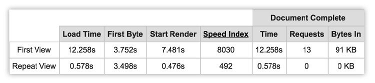

## 3.3 缓存前后的性能比对

此刻，我希望我已经说服了你，Service Worker 缓存是多么优秀。还没！？好吧，希望这些使用缓存后获得的性能改善能令你改变主意！

以我们的 Progressive Times 应用为例，可以比较使用 Service Worker 缓存前后的差别。我最喜欢的一种网站性能测试的方法是使用 webpagetest.org 这个工具。

**图3.9 WebPagetest.org 是一个免费工具，可以使用来自世界各地的真实设备对你的网站进行测试**

Webpagetest.org 是一个很棒的工具。只需简单地输入网站 URL，它就可以让你使用真实设备和各种类型的浏览器从世界任何地点来分析你的网站。测试运行在真实设备上，并为你提供关于网站有用的分类和性能分析。最棒的是，它是开源并且完全免费使用的。

如果我通过 Webpagetest.org 运行我们的示例应用，它会生成类似下面图3.10的表格。

**图3.10 WebPagetest.org 通过使用真实设备生成有关 Web 应用性能的有用信息**

为了在真实设备上测试我们示例应用的性能，我在 Webpagetest 上使用了新加坡的 2G 节点。如果你曾经试图通过缓慢的网络访问一个网站的话，那么你会知道，等待网站完成是多么令人讨厌的过程。对于 Web 开发者来说，重要的是我们应该像用户一样对网站进行测试，其中包括使用速度较慢的移动网络及低端设备。一旦 Webpagetest 完成对 Web 应用的性能分析，它会生成你在上面图3.10中看到的结果。

首次访问，页面加载需要大概12秒。这不怎么理想，但对于很慢的 2G 网络来说这也是意料之中的。但是，如果你再次访问时，页面的加载时间将不到0.5秒，并且不会发送 HTTP 请求给服务器。示例应用使用了应用外壳架构，如果你还记得这种设计的话，你会知道今后任何请求都能快速响应，因为所需资源已经缓存了。如果使用正确的话， Service Worker 缓存会极大的提升应用的整体加载速度，并且无论用户使用的是怎样的设备或网络，都能增强他们的浏览体验。
