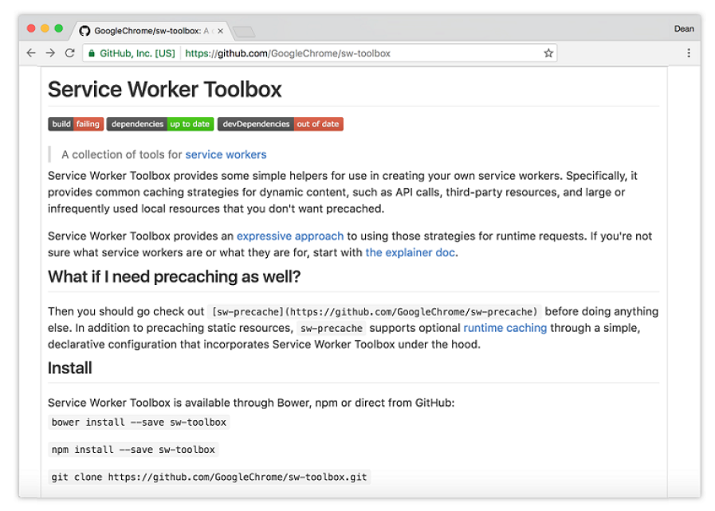

## 3.4 深入 Service Workers 缓存

在本章中，我们先看了如何使用 Service Worker 缓存来提升 Web 应用的性能。本章的剩余部分，我们将密切关注如何对文件进行版本控制，以确保没有不匹配的缓存，以及一些在使用 Service Worker 缓存时可能遇到的问题。

### 3.4.1 对文件进行版本控制

你的 Service Worker 需要有一个更新的时间点。如果你更改了 Web 应用，并想要确保用户接收到最新版本的文件，而不是老版本的。你可以想象一下，错误地提供旧文件会对网站造成严重破坏！

Service Workers 的伟大之处在于每当对 Service Worker 文件本身做出任何更改时，都会自动触发 Service Worker 的更新流程。在第1章中，我们看过了 Service Worker 生命周期。记住当用户导航至你的网站时，浏览器会尝试在后台重新下载 Service Worker 。即使下载的 Service Worker 文件与当前的相比只有一个字节的差别，浏览器也会认为它是新的。

这个有用的功能给予我们完美的机会来使用新文件更新缓存。更新缓存时可以使用两种方式。第一种方式，可以更新用来存储缓存的名称。如果回看清单3.2中的代码，可以看到变量 cacheName 使用的值为 'helloWorld' 。如果你把这个值更新为 'helloWorld-2'，这会自动创建一个新缓存并开始从这个缓存中提供文件。之前的缓存将被孤立并不再使用。

第二种方式，就我个人感觉，它应该是最实用的，就是实际上对文件进行版本控制。这种技术被称为“缓存破坏”，而且已经存在很多年了。当静态文件被缓存时，它可以存储很长一段时间，然后才能到期。如果期间你对网站进行更新，这可能会造成困扰，因为文件的缓存版本存储在访问者的浏览器中，它们可能无法看到所做的更改。通过使用一个唯一的文件版本标识符来告诉浏览器该文件有新版本可用，缓存破坏解决了这个问题。

例如，如果我们想在 HTML 中添加一个 JavaScript 文件的引用，我们可能希望在文件名末尾附加一个哈希字符串，类似于下面的代码。

```html
<script type="text/javascript" src="/js/main-xtvbas65.js"></script>
```

缓存破坏背后的理念是每次更改文件时创建一个全新的文件名，这样以确保浏览器可以获取最新的内容。为了更好地解释缓存破坏，让我们想象一下，在我们的报纸 Web 应用中有这样一个场景。比如说你有一个文件叫做 main.js，你将它存储在缓存之中。根据 Service Worker 的设置方式，每次都会从缓存中获取这个版本的文件。如果你更新了 main.js 文件，Service Worker 仍然会拦截并返回老的缓存版本，尽管你想要的是新版本的文件！但是，如果你将文件重命名为 main.v2.js 并在这个新版本文件中更新了代码，你可以确保浏览器每次都会得到最新版本的文件。用这种方式，你的报纸应用永远都会返回最新的结果给用户。

实现此解决方案有多种不同的方法，使用哪种都取决于你的编码环境。一些开发者更喜欢在构建期间生成这些哈希文件名称，而其他的开发者可能会使用代码并动态生成文件名。无论使用哪种方式，这项技术都是经过验证的，可确保你始终提供正确的文件。

### 3.4.2 处理额外的查询参数

当 Service Worker 检查已缓存的响应时，它使用请求 URL 作为键。默认情况下，请求 URL 必须与用于存储已缓存响应的 URL 完全匹配，包括 URL 查询部分的任何字符串。

如果对文件发起的 HTTP 请求附带了任意查询字符串，并且查询字符串会更改，这可能会导致一些问题。例如，如果你对一个先前匹配的 URL 发起了请求，则可能会发现由于查询字符串略有不同而导致该 URL 找不到。当检查缓存时想要忽略查询字符串，使用 `ignoreSearch` 属性并设置为 true 。

##### 代码清单 3.7

```javascript
self.addEventListener('fetch', function (event) {
  event.respondWith(
    caches.match(event.request, {
      ignoreSearch: true
    }).then(function (response) {
      return response || fetch(event.request);
    })
  );
});
```

清单3.7中代码使用了 `ignoreSearch` 选项来忽略请求参数和缓存请求的 URL 的查询部分。你可以通过使用其他忽略选项 (如 ignoreMethod 和 ignoreVary) 进一步扩展。例如，`ignoreMethod` 选项会忽略请求参数的方法，所以 POST 请求可以匹配缓存中的 GET 项。`ignoreVary` 选项会忽略已缓存响应中的 vary 首部。

### 3.4.3 需要多少内存？

每当我与开发者们谈论 Service Worker 缓存时，经常会出现围绕内存和存储空间的问题。Service Worker 会使用多少空间来进行缓存？这种内存使用是否会影响到我的设备？

最诚实的回答是真的取决于你的设备和它的存储情况。就像所有浏览器的存储，如果设备受到存储压力，浏览器可以自由地丢弃它。这不一定是一个问题，因为数据可以在需要时再次从网络中获取。在第7章中，我们会来看看另一种类型的存储，它被称之为“持久化存储”，它可以用来更持久地存储缓存数据。

现在，老的浏览器仍然能够在它们内存中存储缓存的响应，并且使用的空间不同于 Service Worker 用来缓存资源的空间。唯一的不同的是 Service Worker 缓存让你来掌控并允许你通过程序来创建、更新和删除缓存项，从而使你可以不通过网络连接来访问资源。

### 3.4.4 将缓存提升到一个新的高度 - Servicer Worker toolbox

如果你发现自己在 Service Workers 中编写缓存资源的代码是有规律的，你可能会发现 Service Worker toolbox ([https://github.com/GoogleChrome/sw-toolbox](https://github.com/GoogleChrome/sw-toolbox)) 是有帮助的。它是由 Google 团队编写的，它是一个辅助库，以使你快速开始创建自己的 Service Workers，内置的处理方法能够涵盖最常见的网络策略。只需短短几行代码，你就可以决定是否只是要从缓存中提供指定资源，或者从缓存中提供资源并提供备用方案，或者只能从网络返回资源并且永不缓存。这个库可以让你完全控制缓存策略。



**图3.11 Service Worker toolbox 提供了用于创建 Service Workers 的辅助库。**

Service Worker toolbox 为你提供了一种快速简便的方式来复用常见的网络缓存策略，而不是一次又一次地重写。比方说，你希望确保始终从缓存中取出 CSS 文件，但如果获取不到的话，则回退到通过网络来获取文件。使用 Service Worker toolbox，只需按照同本章中一样的方式注册 Service Worker 即可。接下来，在 Service Worker 文件中导入 toolbox 并开始定义你想要缓存的路由。

##### 代码清单 3.8

```javascript
importScripts('/sw-toolbox/sw-toolbox.js');          ❶

toolbox.router.get('/css/(.*)', toolbox.cacheFirst); ❷
```

* ❶ 加载 Service Worker toolbox 库
* ❷ 开始缓存路径匹配 '/css' 的任何请求

在清单3.8中，先使用 `importScripts` 函数导入 Service Worker toolbox 库。Service Workers 可以访问一个叫做 `importScripts()` 的全局函数，它可以将同一域名下脚本导入至它们的作用域。这是将另一个脚本加载到现有脚本中的一种非常方便的方法。它保持代码整洁，也意味着你只需要在需要时加载文件。

一旦脚本导入后，我们就可以开始定义想要缓存的路由。在上面的清单中，我们定义了一个路由，它匹配路径是 `/css/`，并且永远使用缓存优选的方式。这意味着资源会永远从缓存中提供，如果不存在的话再回退成通过网络获取。Toolbox 还提供了一些其他内置缓存策略，比如只通过缓存获取、只通过网络获取、网络优先、缓存
优先或者尝试从缓存或网络中找到最快的响应。每种策略都可以应用于不同的场景，甚至你可以混用不同的路由来匹配不同的策略，以达到最佳效果。

Service Worker toolbox 还为你提供了预缓存资源的功能。在清单3.2中，我们在 Service Worker 安装期间预缓存了资源，我们可以使用 Service Worker toolbox 以同样的方式来实现，并且只需要一行代码。

#### 代码清单 3.9

```javascript
toolbox.precache(['/js/script.js', '/images/hello.png']);
```

清单3.9中的代码接收在 Service Worker 安装步骤中应该被缓存的 URL 数组。这行代码会确保在 Service Worker 安装阶段资源被缓存。

每当我接手一个新项目时，毫无疑问我喜欢使用的库就是 Service Worker toolbox 。它简化了你的代码并为你提供经过验证的缓存策略，只需几行代码便可实现。事实上，我们在第2章剖析过的 Twitter PWA 也使用了 Service Worker toolbox 来使得代码更容易理解，并依赖于这些经过验证的缓存方法。
