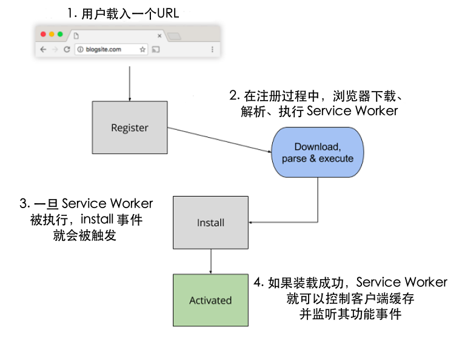
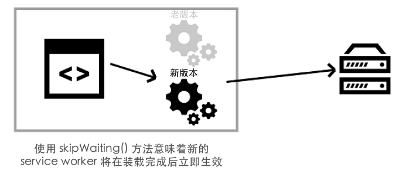

## 4.2 Fetch 事件

Service Worker 拦截任何发出的 HTTP 请求的能力使得它真的非常强大。属于此 Service Worker 作用域内的每个 HTTP 请求将触发此事件，例如 HTML 页面、脚本、图片、CSS，等等。这可以让开发者完全控制浏览器如何处理响应这些资源获取的方式。

在第1章中，我们在实战中看过了 fetch 事件的基础示例。还记得独角兽吗？

##### 代码清单 4.4

```javascript
self.addEventListener('fetch', function (event) {  ❶
  if (/\.jpg$/.test(event.request.url)) {          ❷
    event.respondWith(
      fetch('/images/unicorn.jpg'));               ❸
  }
});
```

* ❶ 为 fetch 事件添加事件监听器
* ❷ 检查传入的 HTTP 请求是否是 JPEG 类型的图片
* ❸ 尝试获取独角兽的图片并用它作为替代图片来响应请求

在上面的代码中，我们监听了 fetch 事件，如果 HTTP 请求的是 JPEG 文件，我们就拦截请求并强制返回一张独角兽图片，而不是原始 URL 请求的图片。上面的代码会为该网站上的每个 JPEG 图片请求执行同样的操作。对于任何其他文件类型，它会直接忽略并继续执行。

同时清单4.4中的代码是个有趣的示例，它并没有展示出 Service Workers 的真正能力。我们会在这个示例的基础上更进一步，返回我们自定义的 HTTP 响应。

##### 代码清单 4.5

```javascript
self.addEventListener('fetch', function (event) {                                        ❶
  if (/\.jpg$/.test(event.request.url)) {                                                ❷
    event.respondWith(
      new Response('<p>This is a response that comes from your service worker!</p>', {
        headers: { 'Content-Type': 'text/html' }                                         ❸
      });
    );
  }
});
```

* ❶ 为 fetch 事件添加事件监听器
* ❷ 检查传入的 HTTP 请求是否是 JPEG 类型的图片
* ❸ 创建自定义 Response 并作出相应地响应

在清单4.5中，代码通过监听 fetch 事件的触发来拦截任何 HTTP 请求。接下来，它判断传入请求是否是 JPEG 文件，如果是的话，就使用自定义 HTTP 响应进行响应。使用 Service Workers ，你能够创建自定义 HTTP 响应，包括编辑响应首部。此功能使得 Service Workers 极其强大，同时也可以理解为什么它们需要通过 HTTPS 请求才能获取。想象一下，如果不是，黑客动动手指便可以完成一些恶意的操作！

### 4.2.1 Service Worker 生命周期

就在本书开头的第1章中，你了解过了 Service Worker 生命周期以及在它构建 PWA 时所扮演的角色。再来仔细看一遍下面的图。



**图4.1 Service Worker 生命周期**

看过上面的图，你会想到当用户第一次访问网站的时候，并不会有激活的 Service Worker 来控制页面。只有当 Service Worker 安装完成并且用户刷新了页面或跳转至网站的其他页面，Service Worker 才会激活并开始拦截请求。

为了更清楚地解释这个问题，我们想象一下，一个单页应用 (SPA) 或一个加载完成后使用 AJAX 进行交互的网页。当注册和安装 Service Worker 时，我们将使用到目前为止在本书中所介绍的方法，页面加载后发生的任何 HTTP 请求都将被忽略。只有当用户刷新页面，Service Worker 才会激活并开始拦截请求。这并不理想，你希望 Service Worker 能尽快开始工作，并包括在 Service Worker 未激活期间所发起的这些请求。

如果你想要 Service Worker 立即开始工作，而不是等待用户跳转至网站的其他页面或刷新本页面，有一个小技巧，你可以用它来立即激活你的 Service Worker 。

##### 代码清单 4.6

```javascript
self.addEventListener('install', function(event) {
  event.waitUntil(self.skipWaiting());
});
```

清单 4.6 中代码重点是在 Service Worker 的 `install` 事件的里面。通过使用 **skipWaiting()** 函数，最终会触发 activate 事件，并告知 Service Worker 立即开始工作，而无需等待用户跳转或刷新页面。



**图4.2 self.skipWaiting() 会使 Service Worker 解雇当前活动的 worker 并且一旦进入等待阶段就会激活自身**

**skipWaiting()** 函数强制等待中的 Service Worker 被激活 。**self.skipWaiting()** 函数还可以与 **self.clients.claim()** 一起使用，以确保底层 Service Worker 的更新立即生效。

下面清单4.7中的代码可以结合 `skipWaiting()` 函数，以确保 Service Worker 立即激活自身。

##### 代码清单 4.7

```javascript
self.addEventListener('activate', function(event) {
  event.waitUntil(self.clients.claim());
});
```

同时使用清单 4.6 和 4.7 中的代码，可以开启 Service Worker 自动激活。如果你的网站在页面加载后会发起复杂的 AJAX 请求，那么这些功能对你来说是完美的。如果你的网站主要是静态页面，而不是在页面加载后发起 HTTP 请求，那么你可能不需要使用这些功能。
