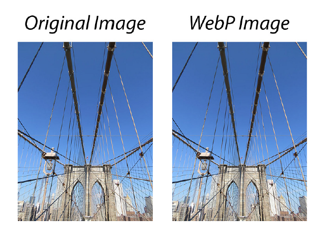
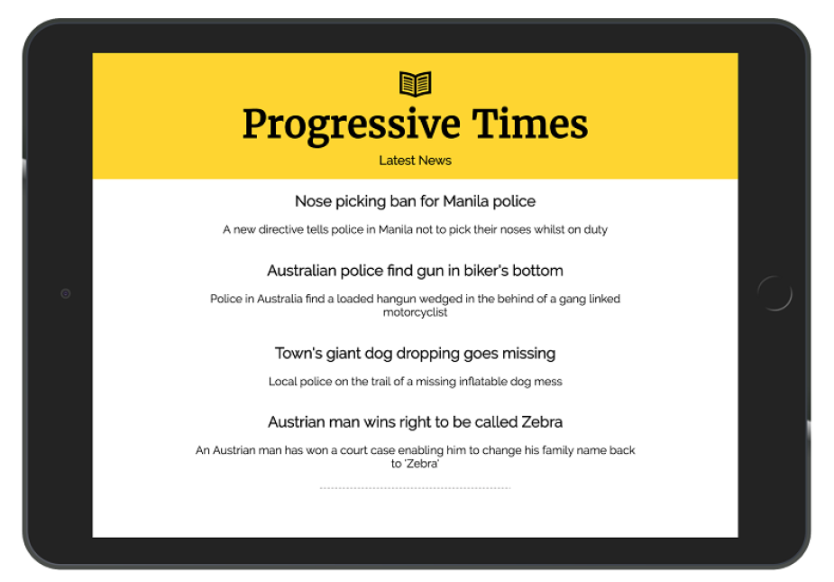
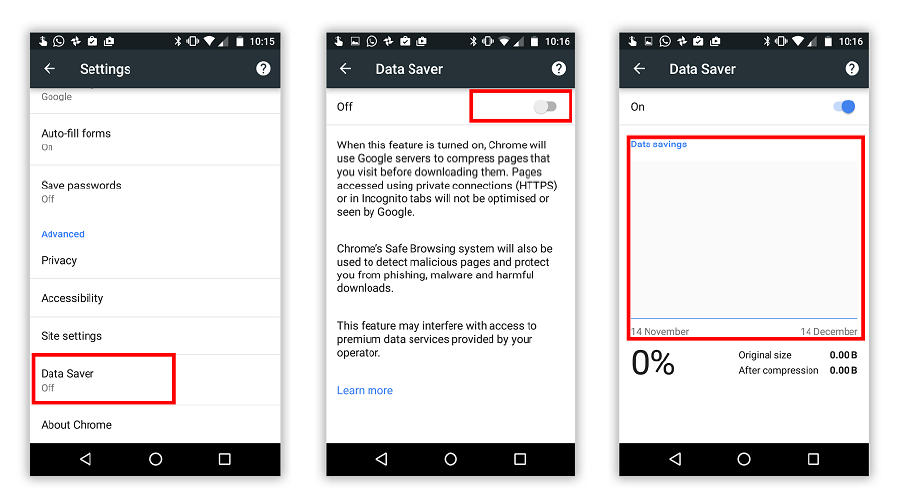
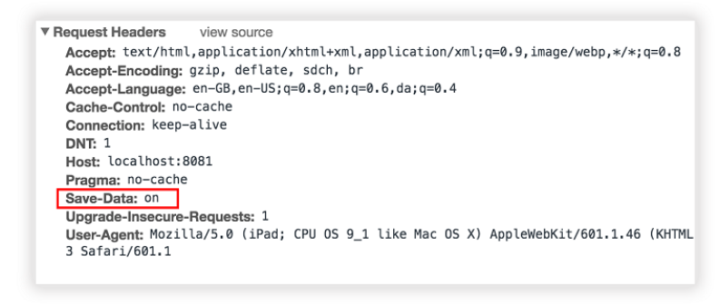

## 4.3 Fetch 实战

正如我们在本章中所看到的，Service Workers 为开发者提供了无限的网络控制权。拦截 HTTP 请求、修改 HTTP 响应以及自定义响应，这些只是通过进入 fetch 事件所获取到的能力的一小部分。

直到此刻，绝大部分我们所看过的代码示例并非真实世界的示例。在下一节中，我们将深入两种有用的技术，可使你的网站更快，更具吸引力和更富弹性。

### 4.3.1 使用 WebP 图片的示例

如今，图片在 Web 上扮演着重要的角色。可以想象下一个网页上完全没有图片的世界！高质量的图片可以真正地使网站出彩，但不幸的是它们也是有代价的。由于它们的文件大小较大，所以需要下载的内容多，导致页面加载慢。如果你曾经使用过网络连接较差的设备，那么你会了解到这种体验有多令人沮丧。

你可能熟悉 WebP 这种图片格式。它是由 Google 团队开发的，与 PNG 图片相比，文件大小减少26%，与 JPEG 图片相比，文件大小大约减少25-34%。这是一个相当不错的节省，最棒的是，选择这种格式图像质量不会受到影响。



**图4.3 与原始格式相比，WebP 图片的文件大小要小得多，并且图片的质量没有显着差异**

图4.3并排展示了两张内容相同、图片质量无显著差别的图片，左边是 JEPG，右边是 WebP 。默认情况下，只有 Chrome、Opera 和 Android 支持 WebP 图片，不幸的是目前 Safari、Firefox 和 IE 还不支持。

支持 WebP 图片的浏览会通过在每个 HTTP 请求中传递 `accept: image/webp` 首部通知你它们能够支持。鉴于我们拥有 Service Workers，这似乎是一个完美的机会，以开始拦截请求，并将更轻，更精简的图片返回给能够渲染它们的浏览器。

假设有下面这样一个基础的网页。它只是引用了一张纽约布鲁克林大桥的图片。

##### 代码清单 4.8

```html
<!DOCTYPE html>
<html>
  <head>
    <meta charset="UTF-8">
    <title>Brooklyn Bridge - New York City</title>
  </head>
  <body>
    <h1>Brooklyn Bridge</h1>
    
    <script>
      // 注册 service worker
      if ('serviceWorker' in navigator) {
        navigator.serviceWorker.register('./service-worker.js').then(function (registration) {
          // 注册成功
          console.log('ServiceWorker registration successful with scope: ', registration.scope);
        }).catch(function (err) {
          // 注册失败 :(
          console.log('ServiceWorker registration failed: ', err);
        });
      }
    </script>
  </body>
</html>
```

清单4.8中的图片是 JPEG 格式，大小为137KB。如果将它转换为 WebP 格式的并存储在服务器上，就能够为支持 WebP 的浏览器返回 WebP 格式，为不支持的返回原始格式。

我们在 Service Worker 中构建代码以开始拦截此图片的 HTTP 请求。

##### 代码清单 4.9

```javascript
"use strict";

// 监听 fetch 事件
self.addEventListener('fetch', function(event) {
 
  if (/\.jpg$|.png$/.test(event.request.url)) {                                   ❶
 
    var supportsWebp = false;
    if (event.request.headers.has('accept')) {                                    ❷
      supportsWebp = event.request.headers
        .get('accept')
        .includes('webp');
    }
 
    if (supportsWebp) {                                                           ❸
       var req = event.request.clone();
 
      var returnUrl = req.url.substr(0, req.url.lastIndexOf(".")) + ".webp";      ❹
 
      event.respondWith(
        fetch(returnUrl, {
          mode: 'no-cors'
        })
      );
    }
  }
});
```

* ❶ 检查传入的 HTTP 请求是否是 JPEG 或 PNG 类型的图片
* ❷ 检查 accept 首部是否支持 WebP
* ❸ 浏览器是否支持 WebP？
* ❹ 创建返回 URL

上面清单中的代码很多，我们分解来看。最开始的几行，我添加了事件监听器来监听任何触发的 fetch 事件。对于每个发起的 HTTP 请求，我会检查当前请求是否是 JEPG 或 PNG 图片。如果我知道当前请求的是图片，我可以根据传递的 HTTP 首部来返回最适合的内容。在本例中，我检查每个首部并寻找 `image/webp` 的 mime 类型。一旦知道首部的值，我便能判断出浏览器是否支持 WebP 并返回相应的 WebP 图片。

一旦 Service Worker 激活并准备好，对于支持 WebP 的浏览器，任何 JPEG 或 PNG 图片的请求都会返回同样内容的 WebP 图片。如果浏览器不支持 WebP 图片，它不会在 HTTP 请求首部中声明支持，Service Worker 会忽略该请求并继续正常工作。

同样内容的 WebP 图片只有87KB，相比于原始的 JPEG 图片，我们节省了59KB，大约是原始文件大小的37%。对于使用移动设备的用户，浏览整个网站会节省想当多的带宽。

Service Workers 开启了一个无限可能性的世界，这个示例可以进行扩展，包含一些其他的图片格式，甚至是缓存。你可以轻松地支持 [叫做 JPEGXR 的 IE 改进图片格式](http://caniuse.com/#feat=jpegxr)。我们没有理由不为我们的用户提供更快的网页！

### 4.3.2 使用 Save-Data 首部的示例

我最近在出国旅行，当我迫切需要从航空公司的网站获取一些信息时，我使用的是 2G 连接，页面永远在加载中，最终我彻底放弃了。回国后，我还得向手机运营商支付日常服务费用，真是太让人不爽了！

在全球范围内，4G网络覆盖面正在迅速发展，但仍有很长的路要走。在2007年底，3G网络仅覆盖了孟加拉国、巴西、中国、印度、尼日利亚、巴基斯坦和俄罗斯等国家，将近全球人口的50％。虽然移动网络覆盖面越来越广，但在印度一个500MB的数据包需要花费相当于17个小时的最低工资，这听起来令人不可思议。

幸运的是，诸如 Google Chrome、Opera 和 Yandex 这样的浏览器厂商已经意识到众多用户所面临的痛苦。使用这些浏览器的最新版本，用户将有一个选项，以允许他们“选择性加入”节省数据的功能。通过启动这项功能，浏览器会为每个 HTTP 请求添加一个新的首部。这是我们这些开发者的机会，寻找这个首部并返回相应的内容，为我们的用户节省数据。例如，如果用户开启了节省数据选项，你可以返回更轻量的图片、更小的视频，甚至是不同的标记。这是一个简单的概念，却行之有效！

这听上去是使用 Service Worker 的完美场景！在下节中，我们将编写代码，它会拦截请求，检查用户是否“选择性加入”节省数据并返回“轻量级”版本的 PWA 。

还记得我们在第3章中构建的 PWA 吗？它叫做 Progressive Times，包含来自世界各地的有趣新闻。



**图4.4 Progressive Times 示例应用是贯穿本书的基础应用**

在 Progressive Times 应用中，我们使用网络字体来提升应用的外观感受。

这些字体是从第三方服务下载的，大约30KB左右。虽然网络字体真的能增强网页的外观感觉，但如果用户只是想节省数据和金钱，那么网页字体似乎是不必要的。无论用户的网络连接情况如何，你的 PWA 都没有理由不去适应用户。

无论你是使用台式机还是移动设备，启用此功能都是相当简单的。如果是在移动设备上，你可以在菜单的设置里开启。



**图4.5 可以在移动设备或手机上开启节省数据功能。注意红色标注的区域。**

一旦设置启用后，每个发送到服务器的 HTTP 请求都会包含 Save-Data 首部。如果使用开发者工具查看，它看起来就如下图所示。



**图4.6 启用了节省数据功能，每个 HTTP 请求都会包含 Save-Data 首部**

一旦启用了节省数据功能，有几种不同的技术可以将数据返回给用户。因为每个 HTTP 请求都会发送到服务器，你可以根据来自服务器端代码中 Save-Data 首部来决定提供不同的内容。然而，只需短短几行 JavaScript 代码就可以使用 Service Workers 的力量，你可以轻松地拦截 HTTP 请求并相应地提供更轻量级的内容。如果你正在开发一个 API 驱动的前端应用，并且完全没有访问服务器，那这就是个完美的选择。

Service Workers 允许你拦截发出的 HTTP 请求，进行检测并根据信息采取行动。使用 Fetch API，你可以轻松实现一个解决方案来检测 Save-Data 首部并提供更轻量级的内容。

我们开始创建一个名为 service-worker.js 的 JavaScript 文件，并添加清单4.10中的代码。

##### 代码清单 4.10

```javascript
"use strict";
 
this.addEventListener('fetch', function (event) {
 
  if(event.request.headers.get('save-data')){
    // 我们想要节省数据，所以限制了图标和字体
    if (event.request.url.includes('fonts.googleapis.com')) {
        // 不返回任何内容
        event.respondWith(new Response('', {status: 417, statusText: 'Ignore fonts to save data.' }));
    }
  }
});
```

基于我们已经看过的示例，清单4.10中代码应该比较熟悉了。在代码的开始几行中，添加了事件监听器以监听任何触发的 fetch 事件。对于每个发起的请求，都会检查首部以查看是否启用了 Save-Data 。

如果启用了 Save-Data 首部，我会检查当前 HTTP 请求是否是来自 “fonts.googleapis.com” 域名的网络字体。因为我想为用户节省任何不必要的数据，我返回一个自定义的 HTTP 响应，状态码为417，状态文本是自定义的。HTTP 状态代码向用户提供来自服务器的特定信息，而417状态码表示“服务器不能满足 Expect 请求首部域的要求”。

通过使用这项简单的技术和几行代码，我们能够减少页面的整体下载量，并确保用户节省了任何不必要的数据。这项技术可以进一步扩展，定制返回低质量的图片或者网站上其他更大的文件下载。

如果你想实际查看本章中的任何代码，它托管在 Github 上，可以通过导航至 [bit.ly/chapter-pwa-4](https://bit.ly/chapter-pwa-4) 轻松访问。
