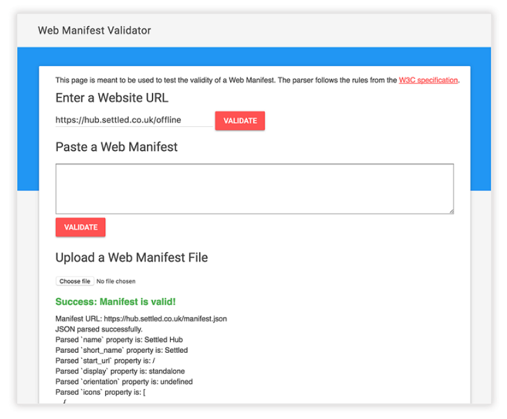

## 5.4 调试清单文件

在本章中，我们已经研究了如何使用 Web 应用清单文件来控制应用的外观，以及如何自定义启动页面、主题颜色，甚至在用户将应用添加到主屏幕后的启动 URL 。Web 应用清单只是简单的 JSON 文件，但由于它是基于文本的，很容易犯错并输入错误的值。幸运的是，有几个不同的选项可用于调试 Web 应用清单，并确保值是正确的。

使用 Google Chrome 或 Opera，你能够在视觉显示直观地看到不同的值。如果你打开 Google Chrome 或 Opera，然后打开开发者工具，你应该看见一个叫做 Application 的标签。如果选择了 Manifest 菜单，你将会看到类似于图5.7的内容。

**图5.7 Google Chrome 和 Opera 的开发者工具都内置了 Web 应用清单文件中的值的可视化工具**

Google Chrome 和 Opera 的开发者工具可让你快速有效地查看 Web 应用清单中的不同值，并进行相应调整。

如果你更喜欢解析 Web 应用清单文件的内容，而不是通过肉眼观察来找出其中是否存在任何重大问题，这有一个方便的在线清单验证工具。如果在浏览器中打开 [manifest-validator.appspot.com](manifest-validator.appspot.com)，可以向验证工具提供 URL 或粘贴 Web 应用清单的内容以进行验证。

**图5.8 当调试 Web 应用清单文件时，清单验证器是非常有用的工具**

Web 应用清单验证器检查文件并使用 W3C 规范以确定它是否有效。如果你无法找到 Web 应用清单出问题的地方，该工具将给你提供反馈，是哪个字符导致的问题，以及可能导致问题的不同原因。