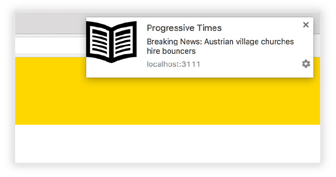
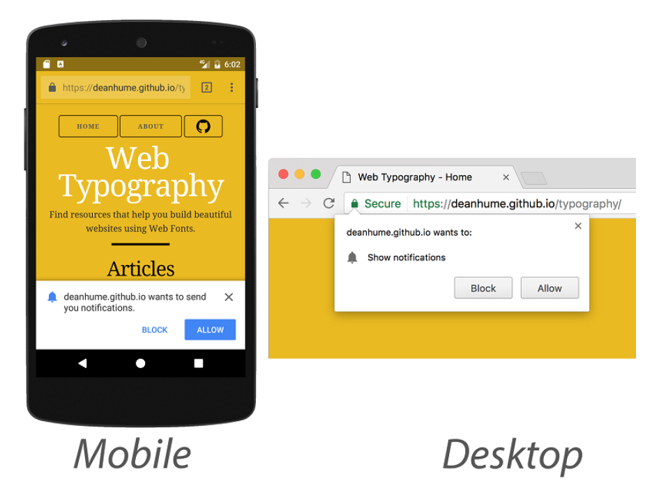

## 6.1 与用户互动

大部分现代 Web 应用都需要定期更新和与用户沟通的能力。比如社交媒体、邮件和应用通知都很不错，但并不总是能够吸引用户的注意，尤其是当他们离开网站的时候。

这正是推送通知出现的契机。它们是出现在你设备上的有用通知，提示可能对你有用的相关信息。你可以简单地滑动或点击按钮来关闭它们，或者可以点击它们，并立即指向具有相关信息的网页。传统上，只有原生应用具有这种超棒的能力，它会利用设备的操作系统并发送推送通知。这也正是 PWA 成为 Web 颠覆者的切入点。它们有能力接收出现在浏览器中的推送通知。

**图6.1 推送通知可以很好的与用户进行互动，尤其是当他们关闭了标签页或访问其他网页的时候**

推送通知最棒的是即使用户没有浏览你的网站也会收到这些更新。体验类似于原生应用，而且即使浏览器没有运行也可以工作。这使它成为与用户互动并将其拉回至 Web 应用的完美方法，即使用户在一段时间内没有打开浏览器。例如，如果你的网站是个天气应用，推送通知可以为你的用户提供像“恶劣天气即将来临的警告”这样有用的信息。你甚至可以安排每周的天气预报，它们可以根据用户订阅的来发送推送通知，这将有无限的可能性！

但要是恶意的网站使用这种技术来发送垃圾推送通知呢？要给用户发送推送通知，他们首先需要用户的授权。每当用户第一次访问 Web 应用时，会自动在为他们呈现一个类似于下面6.2所示的提示。

**图6.2 在用户的设备上会提示他们是否想要接收推送通知**

一旦用户接收或屏蔽推送通知提示，提示不会再次出现。重要的是要注意，只有当站点通过 HTTPS 运行时，有一个注册过的 Service Worker，并且已经为其编写好了代码，才会出现此提示。
