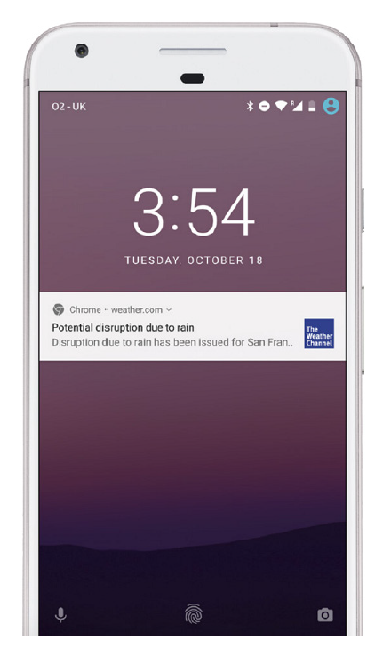

## 6.2 参与度洞见: Weather Channel

Weather Channel 自20世纪80年代以来一直致力于天气预报，现在通过众多平台服务于全世界的人们。天气是不稳定的，为需要的人提供重要的数据并不总是那么容易，所以团队有兴趣改善其移动 Web 体验。

Weather Channel 大约50%的网站流量都是用户通过移动设备访问的。对于 Weather Channel 来说，在用户没有最新的智能手机、可靠的网络连接，或者下载原生应用代价高昂的这块市场中，移动 Web 是极其重要的流量入口。

 

 **图6.3 Weather Channel 使用推送通知来增加自身的网络参与度**

为了迅速扩大发展， Weather Channel 决定在创建一个完整的 PWA 之前在 Web 上实现推送通知。历经了三个月，他们取得了令人瞩目的结果。Weather Channel 数据显示，大约有1亿用户选择接受 Web 推送通知，其中52%来自移动端。Weather Channel 拥有全球范围内的使用者，因此，能够以当地语言为世界各地的人们提供最可靠的天气信息的 PWA 体验一直是增长该用户群体的关键。在技术层面上，他们通过使用了一个支持超过60种语言的代码库来提升效率。

Weather Channel 只是受益于 Web 推送通知的众多组织中的一个。发送你的第一个 Web 推送通知也远比你想象的要简单，我们来开始吧！
