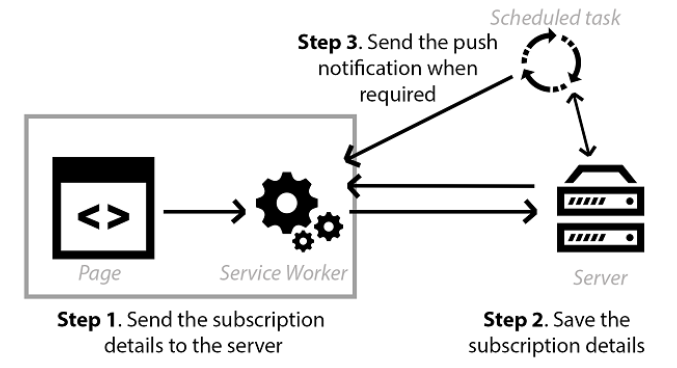
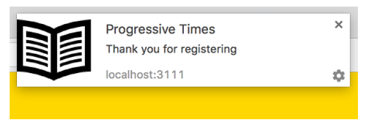

## 6.4 第一个推送通知

在本节中，我们将分解开始发送和接收通知所需的所有部分。为了更好地理解各部分是如何组合在一起的，我们来看看下面的图。

 

 **图6.4 发送推送通知需要三个步骤。首先我们需要提示用户并获得他们的订阅详细信息，然后将这些详细信息保存在服务器上，最后在需要时发送任何消息。**

图6.4展示了为了开始发送推送通知而需要采取的三个步骤。首先，浏览器会显示一个提示以询问用户是否愿意接受通知。如果接受，我们便可以将用户的订阅详细信息保存在服务器上，稍后会使用它们来发送通知。请注意，这些订阅详细信息对于每个用户、设备和浏览器来说是唯一的，所以如果一个用户使用多个设备登录了你的网站，那么每台设备都会提醒该用户是否接受通知。

一旦用户接受了，我们便能够使用这些保存过的订阅详情来给用户发送消息，这可以通过计划任务来完成，该任务可以及时更新用户信息。如果我们使用 Weather Channel 为例，可以使用计划任务来发送你所在地区的每日天气预报。计划任务也可以用于发送诸如龙卷风警报的信息，或者警告人们危险天气临近。

随着本章内容的深入，我们将着眼于服务端和客户端代码。本书中的绝大多数代码示例使用的都是 JavaScript，这也就是我为什么选择 Node.js 来编写服务端代码的原因。如果你不熟悉 Node.js 的话，也请不用担心，这里的代码清单只是作为示例，实际上你可以选择任何服务端语言！当本章结束时，你将能够轻松发送属于你自己的消息。

当你现在考虑 Web 推送通知及其涉及的所有移动部件时，可能看起来任务有些艰巨。当进入到下一节时，我们将逐步地分解来学习，你将会学到如何将所学到的所有部分组合在一起，使你可以订阅用户并开始向他们发送 Web 推送通知。

### 6.4.1 订阅通知

在能开始向用户发送通知前，我们需要通过显示提示的方式来征求他们的允许。这个提示功能是浏览器默认自带的，但首先我们需要添加一些代码来确保提示已经启用。如果用户接受提示的话，你将获得一个包含该用户订阅信息的订阅对象。可如果用户拒绝的话，你将无法向其发送任何消息，并且他们不会再被提示。这样会确保用户不会每次访问我们的网站时都被提示。那样可能会让用户非常反感！

清单6.1展示了注册 Service Worker 的网页。

##### 代码清单 6.1

```html
<!DOCTYPE html>
<html>
  <head>
    <meta charset="UTF-8">
    <title>Progressive Times</title>
    <link rel="manifest" href="/manifest.json">                                        ❶
  </head>
  <body>
    <script>
      var endpoint;
      var key;
      var authSecret;
      var vapidPublicKey = 'BAyb_WgaR0L0pODaR7wWkxJi__tWbM1MPBymyRDFEGjtDCWeRYS9EF7yGoCHLdHJi6hikYdg4MuYaK0XoD0qnoY'; ❷

      function urlBase64ToUint8Array(base64String) {                                    ❸
        const padding = '='.repeat((4 - base64String.length % 4) % 4);
        const base64 = (base64String + padding)
          .replace(/\-/g, '+')
          .replace(/_/g, '/');
        const rawData = window.atob(base64);
        const outputArray = new Uint8Array(rawData.length);
        for (let i = 0; i < rawData.length; ++i) {
          outputArray[i] = rawData.charCodeAt(i);
        }
        return outputArray;
      }
      if ('serviceWorker' in navigator) {
        navigator.serviceWorker.register('sw.js').then(function (registration) {
          return registration.pushManager.getSubscription()                              ❹
            .then(function (subscription) {
              if (subscription) {                                                        ❺
                return;
              }
              return registration.pushManager.subscribe({                                ❻
                  userVisibleOnly: true,
                  applicationServerKey: urlBase64ToUint8Array(vapidPublicKey)
                })
                .then(function (subscription) {
                  var rawKey = subscription.getKey ? subscription.getKey('p256dh') : ''; ❼
                  key = rawKey ? btoa(String.fromCharCode.apply(null, new Uint8Array(rawKey))) : '';
                  var rawAuthSecret = subscription.getKey ? subscription.getKey('auth') : '';
                  authSecret = rawAuthSecret ?
                    btoa(String.fromCharCode.apply(null, new Uint8Array(rawAuthSecret))) : '';
                  endpoint = subscription.endpoint;
                  return fetch('./register', {                                           ❽
                    method: 'post',
                    headers: new Headers({
                      'content-type': 'application/json'
                    }),
                    body: JSON.stringify({
                      endpoint: subscription.endpoint,
                      key: key,
                      authSecret: authSecret,
                    }),
                  });
                });
            });
        }).catch(function (err) {
          // 注册失败 :(
          console.log('ServiceWorker registration failed: ', err);
        });
      }
    </script>
  </body>
</html>
```

* ❶ 在 HEAD 标签中引用了 Web 应用清单文件
* ❷ 客户端和服务端都需要公钥，以确保消息是加密过的
* ❸ 需要将 VAPID 钥从 base64 字符串转换成 Uint8 数组，因为这是 VAPID 规范要求的
* ❹ 获取任何已存在的订阅
* ❺ 如果已经订阅过了，则无需再次注册
* ❻ 还没有订阅过，则显示一个提示
* ❼ 需要从订阅对象中获取 key 和 authSecret
* ❽ 最后，将详细信息发送给服务器以注册用户

清单6.1看上去有些繁琐。为了更好地进行理解，我们一个一个功能研究。我们首先在 HTML 页面的 HEAD 标签中引用了 Web 应用清单文件。在页面底部我们引入了一个有代码的 SCRIPT 标签，我们需要它来开始发送 Web 推送通知。

要想发送推送通知，需要使用 VAPID 协议。VAPID 是“自主应用服务器标识” ( Voluntary Application Server Identification ) 的简称。它是一个规范，它本质上定义了应用服务器和推送服务之间的握手，并允许推送服务确认哪个站点正在发送消息。这很重要，因为这意味着应用服务器能够包含有关其自身的附加信息，可用于联系应用服务器的操作人员。拥有像 VAPID 这样的标准就是向前迈出了一大步，因为这意味着最终所有浏览器都将遵循这个单一标准，即无论什么浏览器，开发者都可以使用 Web 推送进行无缝工作。

在上面的代码中，有一个 VAPID 公钥，发送给服务器的订阅详情中需要它。客户端和服务端代码都需要包含此公钥。目前无需过多考虑它，当我们深入服务端代码时将会看到如何生成一个公钥。

接下来，你可能会注意到我们在本书中经常使用的代码。我们注册了 Service Worker，成功的话我们便可以使用 `registration` 对象中的 `pushManager` 来检测用户是否已经订阅过了。如果用户在这台机器上已经订阅过了，那么便不需要再发送信息给服务器。记住，每个订阅对象包含一个订阅 ID，对于每台机器来说它是唯一的。这对于保护用户隐私很有帮助，因为你不会了解用户的任何信息，而只是一个唯一的 ID。

如果用户还没有订阅，就使用 `pushManager.subscribe()` 函数来提示用户订阅，该函数使用 VAPID 公钥作为识别标示。在提示用户之前，我们需要应用 VAPID 公钥并确保已将其转换为 UInt8 数组。将它转换成 UInt8 数组发送是因为规范只接收此类型。如果用户接受浏览器给出的 Web 推送提示，那么 `subscribe` 函数便返回包含订阅对象的 Promise 。我们可以从这个对象中提取我们所需要的 key 和 authSecret，以便在订阅时将其发送给服务器。

最后，我们使用 Fetch API 来发送 POST 请求到服务器的端点，key 和 authSecret 将用于存储用户的详细信息，并能够在以后发送消息给他们。

### 6.4.2 发送通知

为了让服务端代码尽可能地简单，我使用了 Node.js 服务端，它能够接收用户的订阅详情并使用 Web 推送协议来发送推送消息。服务端使用的是 Express，Express 是一个简约的 Node.js Web 框架。即使这是你首次查看 Node.js 服务端所编写的代码，但它仍然是用 JavaScript 编写的，这种转换相对来说比较容易。

在清单6.2的服务端代码中，我创建了一个端点来监听指向 `/register` 的 POST 请求。这段代码用来保存用户的订阅详情以及向他们发送感谢信息。

##### 代码清单 6.2

```javascript
const webpush = require('web-push');                   ❶
const express = require('express');
var bodyParser = require('body-parser');
const app = express();
webpush.setVapidDetails(                               ❷
  'mailto:contact@deanhume.com',
  'BAyb_WgaR0L0pODaR7wWkxJi__tWbM1MPBymyRDFEGjtDCWeRYS9EF7yGoCHLdHJi6hikYdg4MuYaK0XoD0qnoY',
  'p6YVD7t8HkABoez1CvVJ5bl7BnEdKUu5bSyVjyxMBh0'
);
app.post('/register', function (req, res) {            ❸
  var endpoint = req.body.endpoint;
  saveRegistrationDetails(endpoint, key, authSecret);  ❹
  const pushSubscription = {                           ❺
    endpoint: req.body.endpoint,
    keys: {
      auth: req.body.authSecret,
      p256dh: req.body.key
    }
  };
  var body = 'Thank you for registering';
  var iconUrl = 'https://example.com/images/homescreen.png';
  webpush.sendNotification(pushSubscription,           ❻
      JSON.stringify({
        msg: body,
        url: 'http://localhost:3111/',
        icon: iconUrl
      }))
    .then(result => res.sendStatus(201))
    .catch(err => {
      console.log(err);
    });
});
app.listen(3111, function () {
  console.log('Web push app listening on port 3111!')
});
```

* ❶ 添加必要的依赖
* ❷ 设置 VAPID 详情
* ❸ 监听指向 '/register' 的 POST 请求
* ❹ 保存用户注册详情，这样我们可以在稍后阶段向他们发送消息
* ❺ 建立 pushSubscription 对象
* ❻ 发送 Web 推送消息

在清单6.2中，我们首先引入必需的 Node.js 模块。我引入了 Web Push 库和 Node Express 。

在可以发送任何消息之前，我们还需要创建 VAPID 的设置。记住，需要 VAPID 密钥来定义应用服务器和推送服务之间的握手，并允许推送服务确认哪个站点正在发送消息。可以把它想象成是个简易的身份证。

接下啦，我创建了一个端点，它用来监听发送到 `/register` 的 POST 请求，在此端点中，可以读取发送来的订阅详情并将其保存在数据库中。你需要将用户详情存储在数据库中，这样当你需要推送消息给用户时，便可以简单地循环利用用户的详细信息并将其从服务端发送出去。在这个代码示例中，我并没有演示如何保存用户的订阅详情，你可以自由使用你喜欢的数据库来完成。

我们现在准备开始发送推送消息！使用浏览器发来的唯一订阅详情，清单6.2中的代码会基于它们建立一个 `pushSubscription` 对象。最后，我们使用带有用户唯一详情的 `webpush.sendNotification()` 函数来发送推送通知。这个推送消息，我们只是感谢用户的注册。

为了使清单6.2中的代码正常运行，需要在 HTML 页面中引入 manifest.json 文件。清单6.2中的代码还假定你对 Node.js 有基本的了解。如果你想了解本示例中所使用的代码，并查看端到端的工作解决方案，请查阅本章的 Github 仓库，可以访问 [bit.ly/chapter-pwa-6](bit.ly/chapter-pwa-6) 。

### 6.4.3 接收通知并与之互动

现在我们存储了用户的唯一订阅详情，可以开始给他们发送推送消息了，并为他们提供相关重要通知的及时更新。

在前端代码中，我们需要在 Service Worker 中添加一些代码。清单6.3展示了如何监听推送事件并相应地显示推送通知。

##### 代码清单 6.3

```javascript
self.addEventListener('push', function (event) {
  var payload = event.data ? JSON.parse(event.data.text()) : 'no payload'; ❶
  var title = 'Progressive Times';
  event.waitUntil(
    self.registration.showNotification(title, {                            ❷
      body: payload.msg,
      url: payload.url,
      icon: payload.icon
    })
  );
});
```

* ❶ 检查服务端是否发来了任何有效载荷数据
* ❷ 使用提供的信息来显示 Web 推送通知

清单6.3中的代码会监听 push 事件并读取来自服务端的有效载荷数据。有了有效载荷数据后就可以使用 `showNotification` 函数来显示通知。



**图6.5 Service Worker 中的代码用来监听任何 push 事件并使用提供的数据来显示通知**

万岁！你成功发送了第一个 Web 推送通知。现在你应该会看到通知出现在浏览器中了，然而我们还需要做一件事。为了用户能够与推送通知进行互动，我们需要使用清单6.4中的代码来处理通知的点击事件。

##### 代码清单 6.4

```javascript
self.addEventListener('notificationclick', function (event) {
  event.notification.close();                                ❶
  event.waitUntil(                                           ❷
    clients.matchAll({
      type: "window"
    })
    .then(function (clientList) {
      for (var i = 0; i < clientList.length; i++) {
        var client = clientList[i];
        if (client.url == '/' && 'focus' in client)
          return client.focus();
      }
      if (clients.openWindow) {
        return clients.openWindow('http://localhost:3111');  ❸
      }
    })
  );
});
```

* ❶ 一旦我们点击了通知标题，它便会关闭
* ❷ 检查当前窗口是否已经打开，如果已打开则切换至当前窗口
* ❸ 点击后打开该 URL

清单6.4中的代码监听通知标题的点击事件。一旦触发，它会关闭通知标题，然后使用给定的 URL 开启新窗口。一切准备就绪后，浏览器应该接收到类似于上面图6.5中的推送通知。

完成发送推送通知所需的必要步骤后，根据不同的事件添加更多的通知要容易得多。我们上面写的代码种最棒的部分是，你的用户能够开始深度融入到 Web 体验之中，即使他们已经关闭该选项卡或去浏览其他选项卡。

能够发送这些消息是 Web 的一大进步，但是基本的推送通知只允许用户单击消息或完全关闭消息。为了将推送通知提升一个等级，可以使用通知操作来真正地与用户互动起来。使用通知操作，你可以定义用户可以调用并与之交互的情景操作。这些操作会作为按钮出现，用户可以选择他们想执行的操作。我们来为我们的 Progressive Times Web 应用添加此功能。

接收此通知的一些用户会使用具有振动功能的设备，例如移动电话。为了开启振动功能，我们可以为通知添加振动模式。振动模式可以是数字数组，也可以是单个数字，但它会被看作单个数字的数组。数组中的值表示以毫秒为单位的时间，索引为偶数的数字表示振动的时间，索引为奇数的数字表示在下一次振动之前暂停多久。我们来更进一步，将振动功能添加到推送通知中！

##### 代码清单 6.5

```javascript
self.addEventListener('push', function (event) {
  var payload = event.data ? JSON.parse(event.data.text()) : 'no payload';
  var title = 'Progressive Times';
  event.waitUntil(
    self.registration.showNotification(title, {
      body: payload.msg,
      url: payload.url,
      icon: payload.icon,
      actions: [
        { action: 'voteup',   title: '𑠀 Vote Up'   }, ❶
        { action: 'votedown', title: '𑠀 Vote Down' }
      ],
      vibrate: [300, 100, 400]                         ❷
    })
  );
});
```

* ❶ 出现在通知中的操作
* ❷ 振动300毫秒，然后暂停100毫秒，然后再振动400毫秒

清单6.5中代码监听从服务端发来的任何 `push` 事件，然后基于有效载荷信息显示通知。当 `showNotification` 函数被调用时，我们为通知添加了 `actions` 数组。这些操作会出现在通知中，看起来类似与下面的图6.6。


**图6.6 可以使用通知操作来增强推送通知。**

##### 代码清单 6.6

```javascript
self.addEventListener('notificationclick', function (event) {
  event.notification.close();                          ❶
  if (event.action === 'voteup') {                     ❷
    clients.openWindow('http://localhost:/voteup');
  } else {
    clients.openWindow('http://localhost:/votedown');  ❸
  }
}, false);
```

* ❶ 一旦用户点击了通知标题，它便会关闭
* ❷ 确定用户选择了哪个操作
* ❸ 根据用户的选择，将他们引导至正确的 URL

清单6.6中代码监听了通知的点击事件。一旦点击了，我们就能够知道用户选择的操作，并将其引导至相应的 URL 。`event.action` 属性包含了用户的选择，可以根据它打开一个新的浏览器窗口。

当把所有代码组合起来，并发送消息时，应该如上图6.6所示。推送通知可让你的用户选择及时更新他们喜爱的网站，并允许你使用自定义、吸引人的内容来重新吸引他们。现在你已经具备发送推送通知所需的基本工具，一切尽在你的选择！

### 6.4.4 取消订阅

用户能够通过改变浏览器中的一些设置来取消订阅，但是你可能需要以编程方式来取消某个用户的订阅。例如，你可以在页面中添加一个简单的按钮，通过点击按钮来允许用户取消订阅，而不是让用户在浏览器设置中到处找寻。

清单6.7中的代码展示了如何实现此功能。

##### 代码清单 6.7

```html
<!DOCTYPE html>
<html>
  <head>
    <meta charset="UTF-8">
    <title>Progressive Times</title>
    <link rel="manifest" href="/manifest.json">
    <button type="button" id="unsubscribe">Unsubscribe</button>                                 ❶
  </head>
  <body>
    <script>
      function unsubscribe() {
        if ('serviceWorker' in navigator) {
          navigator.serviceWorker.ready
            .then((serviceWorkerRegistration) => {
              serviceWorkerRegistration.pushManager.getSubscription()                            ❷
                .then((subscription) => {
                  if (!subscription) {
                    console.log("Not subscribed, nothing to do.");
                    return;
                  }

                  subscription.unsubscribe()                                                     ❸
                    .then(function () {
                      console.log("Successfully unsubscribed!.");
                    })
                    .catch((e) => {
                      logger.error('Error thrown while unsubscribing from push messaging', e);
                    });
                });
            });
        }
      }
      document.getElementById("unsubscribe").addEventListener("click", unsubscribe);             ❹
    </script>
  </body>
</html>
```

* ❶ 取消订阅按钮
* ❷ 检查用户是否已经订阅
* ❸ 如果用户已经订阅，就取消订阅
* ❹ 为取消订阅按钮添加点击事件的事件监听器

清单6.7中代码是非常基础的示例，它展示了如何使用按钮来取消用户的订阅。清单中的代码首先会使用 `pushManager.getSubscription()` 函数来检查用户是否已经订阅。如果订阅过的话，就使用 `subscription.unsubscribe()` 函数来取消订阅。最后我们为按钮添加了事件监听器，它会触发取消订阅代码。
