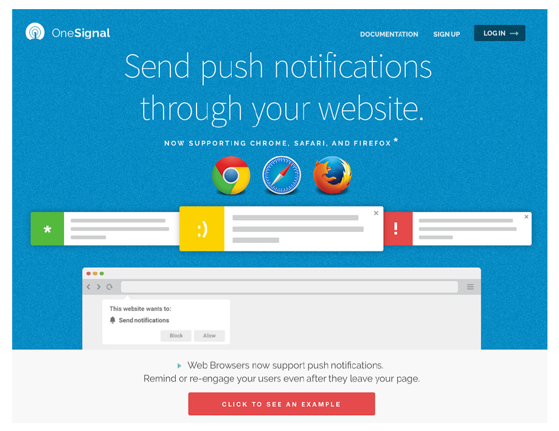

## 6.5 第三方推送通知

可以想象下，将推送通知发送到多种不同浏览器的业务可能会很麻烦。如果你不想自己搭建推送通知服务器，而是使用 SaaS 产品的话，那么有一些现成的第三方解决方案。

 

**图6.7 第三方服务提供增强的功能，这是向多个用户发送推送通知而无需关心他们使用何种浏览器的好方法**

像 OneSignal、Roost 和 Aimtell 这样的服务都提供这样的解决方案，它们能够定位多个浏览器，并为你提供增强的功能。这些服务之中有一些已经创建了库来处理所有主流浏览器，这意味着你能覆盖更多的用户群体而不用关心他们使用的是什么浏览器。这些服务还提供了大量的内置功能，能让你安排定时消息的推送，甚至还提供了复杂的报告图表以让你真正地深入了解用户如何与通知进行交互。